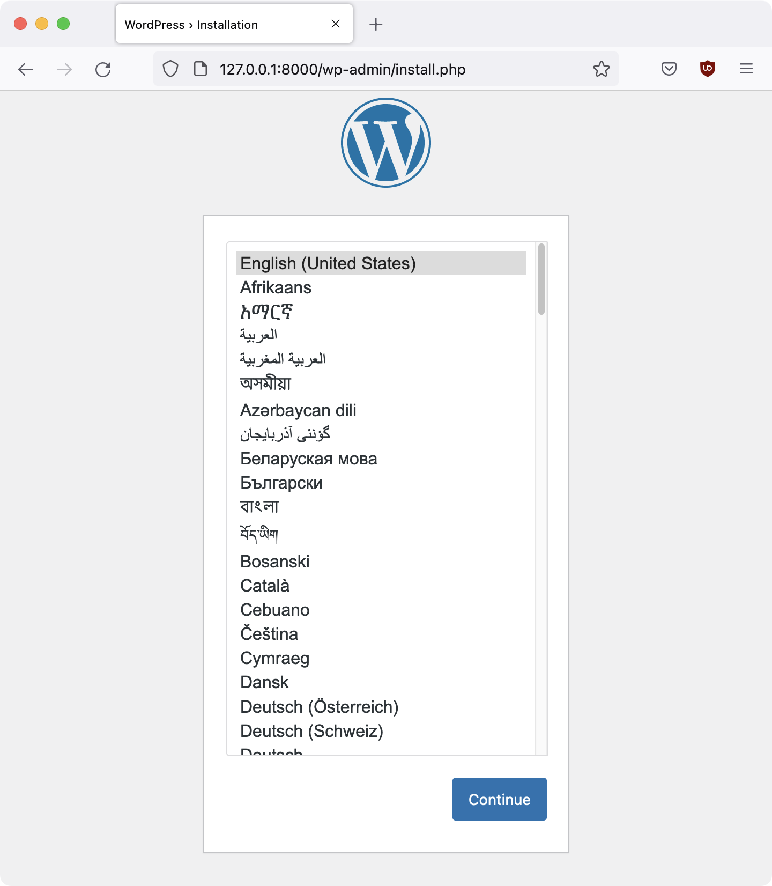

# Homework 5-3: Quickly Run a WordPress Server With Docker Compose

You can find the `docker-compose.yaml` file used in this homework [here](./homework-5-3/docker-compose.yaml).

## Make a `docker-compose.yaml` File

Make a new homework folder just for this assignment, and copy `docker-compose.yaml` into it.

## Bring Up the Containers

Change to this folder and bring up the containers:

```sh
docker-compose up
```

Example:

```
micah@trapdoor homework-5-3 % docker-compose up
[+] Running 34/34
 ⠿ db Pulled                                                              27.4s
   ⠿ 6552179c3509 Pull complete                                           14.3s
   ⠿ d69aa66e4482 Pull complete                                           14.4s
   ⠿ 3b19465b002b Pull complete                                           14.8s
   ⠿ 7b0d0cfe99a1 Pull complete                                           15.0s
   ⠿ 9ccd5a5c8987 Pull complete                                           15.1s
   ⠿ 44f5f7765d10 Pull complete                                           16.5s
   ⠿ 7e8f1dd5efbe Pull complete                                           16.6s
   ⠿ ab45b9a309e7 Pull complete                                           16.7s
   ⠿ 90242da46c57 Pull complete                                           23.3s
   ⠿ 9a8d822d1293 Pull complete                                           23.3s
   ⠿ 1704bf9fa775 Pull complete                                           23.4s
 ⠿ wordpress Pulled                                                       24.0s
   ⠿ 5eb5b503b376 Pull complete                                            5.3s
   ⠿ 8b1ad84cf101 Pull complete                                            5.4s
   ⠿ 38c937dadeb7 Pull complete                                           12.6s
   ⠿ 6a2f1dc96e59 Pull complete                                           12.7s
   ⠿ f8c3f82c39d4 Pull complete                                           14.0s
   ⠿ 90fc6462bd8e Pull complete                                           14.0s
   ⠿ c670d99116c9 Pull complete                                           14.1s
   ⠿ a8b5d4e23f03 Pull complete                                           14.3s
   ⠿ 9e2a6d8c1af3 Pull complete                                           14.4s
   ⠿ 597ec1209872 Pull complete                                           15.6s
   ⠿ fe74968caee0 Pull complete                                           15.7s
   ⠿ c51e1df1e33f Pull complete                                           15.8s
   ⠿ 99b82a1163e0 Pull complete                                           15.9s
   ⠿ b1ff08bec31f Pull complete                                           17.2s
   ⠿ 404a58a10072 Pull complete                                           18.3s
   ⠿ e148fbb32ea5 Pull complete                                           18.4s
   ⠿ f5a3ae8ca1b9 Pull complete                                           18.5s
   ⠿ 65c5759819bc Pull complete                                           18.6s
   ⠿ 05b95ec40549 Pull complete                                           20.1s
   ⠿ a7819ab16fff Pull complete                                           20.2s
   ⠿ c3b900b38c5d Pull complete                                           20.2s
[+] Running 5/5
 ⠿ Network homework-5-3_default          Created                           0.1s
 ⠿ Volume "homework-5-3_wordpress_data"  Created                           0.0s
 ⠿ Volume "homework-5-3_db_data"         Created                           0.0s
 ⠿ Container homework-5-3-db-1           Created                           0.1s
 ⠿ Container homework-5-3-wordpress-1    Created                           0.1s
Attaching to homework-5-3-db-1, homework-5-3-wordpress-1
homework-5-3-db-1         | 2022-02-25 16:59:19+00:00 [Note] [Entrypoint]: Entrypoint script for MySQL Server 5.7.37-1debian10 started.
homework-5-3-db-1         | 2022-02-25 16:59:20+00:00 [Note] [Entrypoint]: Switching to dedicated user 'mysql'
homework-5-3-db-1         | 2022-02-25 16:59:20+00:00 [Note] [Entrypoint]: Entrypoint script for MySQL Server 5.7.37-1debian10 started.
homework-5-3-db-1         | 2022-02-25 16:59:20+00:00 [Note] [Entrypoint]: Initializing database files
homework-5-3-db-1         | 2022-02-25T16:59:20.168908Z 0 [Warning] TIMESTAMP with implicit DEFAULT value is deprecated. Please use --explicit_defaults_for_timestamp server option (see documentation for more details).
homework-5-3-db-1         | 2022-02-25T16:59:20.347335Z 0 [Warning] InnoDB: New log files created, LSN=45790
homework-5-3-db-1         | 2022-02-25T16:59:20.374136Z 0 [Warning] InnoDB: Creating foreign key constraint system tables.
homework-5-3-db-1         | 2022-02-25T16:59:20.378807Z 0 [Warning] No existing UUID has been found, so we assume that this is the first time that this server has been started. Generating a new UUID: 466470da-965c-11ec-ada7-0242ac120002.
homework-5-3-db-1         | 2022-02-25T16:59:20.379849Z 0 [Warning] Gtid table is not ready to be used. Table 'mysql.gtid_executed' cannot be opened.
homework-5-3-wordpress-1  | WordPress not found in /var/www/html - copying now...
homework-5-3-db-1         | 2022-02-25T16:59:20.920065Z 0 [Warning] A deprecated TLS version TLSv1 is enabled. Please use TLSv1.2 or higher.
homework-5-3-db-1         | 2022-02-25T16:59:20.920104Z 0 [Warning] A deprecated TLS version TLSv1.1 is enabled. Please use TLSv1.2 or higher.
homework-5-3-db-1         | 2022-02-25T16:59:20.920918Z 0 [Warning] CA certificate ca.pem is self signed.
homework-5-3-wordpress-1  | Complete! WordPress has been successfully copied to /var/www/html
homework-5-3-wordpress-1  | No 'wp-config.php' found in /var/www/html, but 'WORDPRESS_...' variables supplied; copying 'wp-config-docker.php' (WORDPRESS_DB_HOST WORDPRESS_DB_NAME WORDPRESS_DB_PASSWORD WORDPRESS_DB_USER)
homework-5-3-db-1         | 2022-02-25T16:59:21.299793Z 1 [Warning] root@localhost is created with an empty password ! Please consider switching off the --initialize-insecure option.
homework-5-3-wordpress-1  | AH00558: apache2: Could not reliably determine the server's fully qualified domain name, using 172.18.0.3. Set the 'ServerName' directive globally to suppress this message
homework-5-3-wordpress-1  | AH00558: apache2: Could not reliably determine the server's fully qualified domain name, using 172.18.0.3. Set the 'ServerName' directive globally to suppress this message
homework-5-3-wordpress-1  | [Fri Feb 25 16:59:21.656520 2022] [mpm_prefork:notice] [pid 1] AH00163: Apache/2.4.52 (Debian) PHP/7.4.28 configured -- resuming normal operations
homework-5-3-wordpress-1  | [Fri Feb 25 16:59:21.656618 2022] [core:notice] [pid 1] AH00094: Command line: 'apache2 -D FOREGROUND'
homework-5-3-db-1         | 2022-02-25 16:59:23+00:00 [Note] [Entrypoint]: Database files initialized
homework-5-3-db-1         | 2022-02-25 16:59:23+00:00 [Note] [Entrypoint]: Starting temporary server
homework-5-3-db-1         | 2022-02-25 16:59:23+00:00 [Note] [Entrypoint]: Waiting for server startup
homework-5-3-db-1         | 2022-02-25T16:59:23.540512Z 0 [Warning] TIMESTAMP with implicit DEFAULT value is deprecated. Please use --explicit_defaults_for_timestamp server option (see documentation for more details).
homework-5-3-db-1         | 2022-02-25T16:59:23.541713Z 0 [Note] mysqld (mysqld 5.7.37) starting as process 78 ...
homework-5-3-db-1         | 2022-02-25T16:59:23.544899Z 0 [Note] InnoDB: PUNCH HOLE support available
homework-5-3-db-1         | 2022-02-25T16:59:23.544947Z 0 [Note] InnoDB: Mutexes and rw_locks use GCC atomic builtins
homework-5-3-db-1         | 2022-02-25T16:59:23.544951Z 0 [Note] InnoDB: Uses event mutexes
homework-5-3-db-1         | 2022-02-25T16:59:23.544954Z 0 [Note] InnoDB: GCC builtin __atomic_thread_fence() is used for memory barrier
homework-5-3-db-1         | 2022-02-25T16:59:23.544956Z 0 [Note] InnoDB: Compressed tables use zlib 1.2.11
homework-5-3-db-1         | 2022-02-25T16:59:23.544958Z 0 [Note] InnoDB: Using Linux native AIO
homework-5-3-db-1         | 2022-02-25T16:59:23.545183Z 0 [Note] InnoDB: Number of pools: 1
homework-5-3-db-1         | 2022-02-25T16:59:23.545341Z 0 [Note] InnoDB: Using CPU crc32 instructions
homework-5-3-db-1         | 2022-02-25T16:59:23.547305Z 0 [Note] InnoDB: Initializing buffer pool, total size = 128M, instances = 1, chunk size = 128M
homework-5-3-db-1         | 2022-02-25T16:59:23.556519Z 0 [Note] InnoDB: Completed initialization of buffer pool
homework-5-3-db-1         | 2022-02-25T16:59:23.558514Z 0 [Note] InnoDB: If the mysqld execution user is authorized, page cleaner thread priority can be changed. See the man page of setpriority().
homework-5-3-db-1         | 2022-02-25T16:59:23.570280Z 0 [Note] InnoDB: Highest supported file format is Barracuda.
homework-5-3-db-1         | 2022-02-25T16:59:23.578084Z 0 [Note] InnoDB: Creating shared tablespace for temporary tables
homework-5-3-db-1         | 2022-02-25T16:59:23.578168Z 0 [Note] InnoDB: Setting file './ibtmp1' size to 12 MB. Physically writing the file full; Please wait ...
homework-5-3-db-1         | 2022-02-25T16:59:23.598781Z 0 [Note] InnoDB: File './ibtmp1' size is now 12 MB.
homework-5-3-db-1         | 2022-02-25T16:59:23.599453Z 0 [Note] InnoDB: 96 redo rollback segment(s) found. 96 redo rollback segment(s) are active.
homework-5-3-db-1         | 2022-02-25T16:59:23.599489Z 0 [Note] InnoDB: 32 non-redo rollback segment(s) are active.
homework-5-3-db-1         | 2022-02-25T16:59:23.599897Z 0 [Note] InnoDB: Waiting for purge to start
homework-5-3-db-1         | 2022-02-25T16:59:23.650164Z 0 [Note] InnoDB: 5.7.37 started; log sequence number 2749976
homework-5-3-db-1         | 2022-02-25T16:59:23.650541Z 0 [Note] InnoDB: Loading buffer pool(s) from /var/lib/mysql/ib_buffer_pool
homework-5-3-db-1         | 2022-02-25T16:59:23.650626Z 0 [Note] Plugin 'FEDERATED' is disabled.
homework-5-3-db-1         | 2022-02-25T16:59:23.652380Z 0 [Note] InnoDB: Buffer pool(s) load completed at 220225 16:59:23
homework-5-3-db-1         | 2022-02-25T16:59:23.655989Z 0 [Note] Found ca.pem, server-cert.pem and server-key.pem in data directory. Trying to enable SSL support using them.
homework-5-3-db-1         | 2022-02-25T16:59:23.656036Z 0 [Note] Skipping generation of SSL certificates as certificate files are present in data directory.
homework-5-3-db-1         | 2022-02-25T16:59:23.656042Z 0 [Warning] A deprecated TLS version TLSv1 is enabled. Please use TLSv1.2 or higher.
homework-5-3-db-1         | 2022-02-25T16:59:23.656044Z 0 [Warning] A deprecated TLS version TLSv1.1 is enabled. Please use TLSv1.2 or higher.
homework-5-3-db-1         | 2022-02-25T16:59:23.656719Z 0 [Warning] CA certificate ca.pem is self signed.
homework-5-3-db-1         | 2022-02-25T16:59:23.656750Z 0 [Note] Skipping generation of RSA key pair as key files are present in data directory.
homework-5-3-db-1         | 2022-02-25T16:59:23.659452Z 0 [Warning] Insecure configuration for --pid-file: Location '/var/run/mysqld' in the path is accessible to all OS users. Consider choosing a different directory.
homework-5-3-db-1         | 2022-02-25T16:59:23.667026Z 0 [Note] Event Scheduler: Loaded 0 events
homework-5-3-db-1         | 2022-02-25T16:59:23.667968Z 0 [Note] mysqld: ready for connections.
homework-5-3-db-1         | Version: '5.7.37'  socket: '/var/run/mysqld/mysqld.sock'  port: 0  MySQL Community Server (GPL)
homework-5-3-db-1         | 2022-02-25 16:59:24+00:00 [Note] [Entrypoint]: Temporary server started.
homework-5-3-db-1         | Warning: Unable to load '/usr/share/zoneinfo/iso3166.tab' as time zone. Skipping it.
homework-5-3-db-1         | Warning: Unable to load '/usr/share/zoneinfo/leap-seconds.list' as time zone. Skipping it.
homework-5-3-db-1         | Warning: Unable to load '/usr/share/zoneinfo/zone.tab' as time zone. Skipping it.
homework-5-3-db-1         | Warning: Unable to load '/usr/share/zoneinfo/zone1970.tab' as time zone. Skipping it.
homework-5-3-db-1         | 2022-02-25 16:59:26+00:00 [Note] [Entrypoint]: Creating database wordpress
homework-5-3-db-1         | 2022-02-25 16:59:26+00:00 [Note] [Entrypoint]: Creating user wordpress
homework-5-3-db-1         | 2022-02-25 16:59:26+00:00 [Note] [Entrypoint]: Giving user wordpress access to schema wordpress
homework-5-3-db-1         | 
homework-5-3-db-1         | 2022-02-25 16:59:26+00:00 [Note] [Entrypoint]: Stopping temporary server
homework-5-3-db-1         | 2022-02-25T16:59:26.728281Z 0 [Note] Giving 0 client threads a chance to die gracefully
homework-5-3-db-1         | 2022-02-25T16:59:26.728365Z 0 [Note] Shutting down slave threads
homework-5-3-db-1         | 2022-02-25T16:59:26.728380Z 0 [Note] Forcefully disconnecting 0 remaining clients
homework-5-3-db-1         | 2022-02-25T16:59:26.728386Z 0 [Note] Event Scheduler: Purging the queue. 0 events
homework-5-3-db-1         | 2022-02-25T16:59:26.728468Z 0 [Note] Binlog end
homework-5-3-db-1         | 2022-02-25T16:59:26.729345Z 0 [Note] Shutting down plugin 'ngram'
homework-5-3-db-1         | 2022-02-25T16:59:26.729380Z 0 [Note] Shutting down plugin 'partition'
homework-5-3-db-1         | 2022-02-25T16:59:26.729385Z 0 [Note] Shutting down plugin 'BLACKHOLE'
homework-5-3-db-1         | 2022-02-25T16:59:26.729388Z 0 [Note] Shutting down plugin 'ARCHIVE'
homework-5-3-db-1         | 2022-02-25T16:59:26.729389Z 0 [Note] Shutting down plugin 'PERFORMANCE_SCHEMA'
homework-5-3-db-1         | 2022-02-25T16:59:26.729411Z 0 [Note] Shutting down plugin 'MRG_MYISAM'
homework-5-3-db-1         | 2022-02-25T16:59:26.729414Z 0 [Note] Shutting down plugin 'MyISAM'
homework-5-3-db-1         | 2022-02-25T16:59:26.729421Z 0 [Note] Shutting down plugin 'INNODB_SYS_VIRTUAL'
homework-5-3-db-1         | 2022-02-25T16:59:26.729424Z 0 [Note] Shutting down plugin 'INNODB_SYS_DATAFILES'
homework-5-3-db-1         | 2022-02-25T16:59:26.729426Z 0 [Note] Shutting down plugin 'INNODB_SYS_TABLESPACES'
homework-5-3-db-1         | 2022-02-25T16:59:26.729429Z 0 [Note] Shutting down plugin 'INNODB_SYS_FOREIGN_COLS'
homework-5-3-db-1         | 2022-02-25T16:59:26.729431Z 0 [Note] Shutting down plugin 'INNODB_SYS_FOREIGN'
homework-5-3-db-1         | 2022-02-25T16:59:26.729433Z 0 [Note] Shutting down plugin 'INNODB_SYS_FIELDS'
homework-5-3-db-1         | 2022-02-25T16:59:26.729436Z 0 [Note] Shutting down plugin 'INNODB_SYS_COLUMNS'
homework-5-3-db-1         | 2022-02-25T16:59:26.729438Z 0 [Note] Shutting down plugin 'INNODB_SYS_INDEXES'
homework-5-3-db-1         | 2022-02-25T16:59:26.729440Z 0 [Note] Shutting down plugin 'INNODB_SYS_TABLESTATS'
homework-5-3-db-1         | 2022-02-25T16:59:26.729443Z 0 [Note] Shutting down plugin 'INNODB_SYS_TABLES'
homework-5-3-db-1         | 2022-02-25T16:59:26.729445Z 0 [Note] Shutting down plugin 'INNODB_FT_INDEX_TABLE'
homework-5-3-db-1         | 2022-02-25T16:59:26.729447Z 0 [Note] Shutting down plugin 'INNODB_FT_INDEX_CACHE'
homework-5-3-db-1         | 2022-02-25T16:59:26.729449Z 0 [Note] Shutting down plugin 'INNODB_FT_CONFIG'
homework-5-3-db-1         | 2022-02-25T16:59:26.729452Z 0 [Note] Shutting down plugin 'INNODB_FT_BEING_DELETED'
homework-5-3-db-1         | 2022-02-25T16:59:26.729454Z 0 [Note] Shutting down plugin 'INNODB_FT_DELETED'
homework-5-3-db-1         | 2022-02-25T16:59:26.729457Z 0 [Note] Shutting down plugin 'INNODB_FT_DEFAULT_STOPWORD'
homework-5-3-db-1         | 2022-02-25T16:59:26.729459Z 0 [Note] Shutting down plugin 'INNODB_METRICS'
homework-5-3-db-1         | 2022-02-25T16:59:26.729461Z 0 [Note] Shutting down plugin 'INNODB_TEMP_TABLE_INFO'
homework-5-3-db-1         | 2022-02-25T16:59:26.729464Z 0 [Note] Shutting down plugin 'INNODB_BUFFER_POOL_STATS'
homework-5-3-db-1         | 2022-02-25T16:59:26.729466Z 0 [Note] Shutting down plugin 'INNODB_BUFFER_PAGE_LRU'
homework-5-3-db-1         | 2022-02-25T16:59:26.729469Z 0 [Note] Shutting down plugin 'INNODB_BUFFER_PAGE'
homework-5-3-db-1         | 2022-02-25T16:59:26.729471Z 0 [Note] Shutting down plugin 'INNODB_CMP_PER_INDEX_RESET'
homework-5-3-db-1         | 2022-02-25T16:59:26.729474Z 0 [Note] Shutting down plugin 'INNODB_CMP_PER_INDEX'
homework-5-3-db-1         | 2022-02-25T16:59:26.729476Z 0 [Note] Shutting down plugin 'INNODB_CMPMEM_RESET'
homework-5-3-db-1         | 2022-02-25T16:59:26.729479Z 0 [Note] Shutting down plugin 'INNODB_CMPMEM'
homework-5-3-db-1         | 2022-02-25T16:59:26.729481Z 0 [Note] Shutting down plugin 'INNODB_CMP_RESET'
homework-5-3-db-1         | 2022-02-25T16:59:26.729484Z 0 [Note] Shutting down plugin 'INNODB_CMP'
homework-5-3-db-1         | 2022-02-25T16:59:26.729486Z 0 [Note] Shutting down plugin 'INNODB_LOCK_WAITS'
homework-5-3-db-1         | 2022-02-25T16:59:26.729531Z 0 [Note] Shutting down plugin 'INNODB_LOCKS'
homework-5-3-db-1         | 2022-02-25T16:59:26.729537Z 0 [Note] Shutting down plugin 'INNODB_TRX'
homework-5-3-db-1         | 2022-02-25T16:59:26.729540Z 0 [Note] Shutting down plugin 'InnoDB'
homework-5-3-db-1         | 2022-02-25T16:59:26.729669Z 0 [Note] InnoDB: FTS optimize thread exiting.
homework-5-3-db-1         | 2022-02-25T16:59:26.730172Z 0 [Note] InnoDB: Starting shutdown...
homework-5-3-db-1         | 2022-02-25T16:59:26.833367Z 0 [Note] InnoDB: Dumping buffer pool(s) to /var/lib/mysql/ib_buffer_pool
homework-5-3-db-1         | 2022-02-25T16:59:26.834552Z 0 [Note] InnoDB: Buffer pool(s) dump completed at 220225 16:59:26
homework-5-3-db-1         | 2022-02-25T16:59:28.481505Z 0 [Note] InnoDB: Shutdown completed; log sequence number 12659898
homework-5-3-db-1         | 2022-02-25T16:59:28.485495Z 0 [Note] InnoDB: Removed temporary tablespace data file: "ibtmp1"
homework-5-3-db-1         | 2022-02-25T16:59:28.485642Z 0 [Note] Shutting down plugin 'MEMORY'
homework-5-3-db-1         | 2022-02-25T16:59:28.485666Z 0 [Note] Shutting down plugin 'CSV'
homework-5-3-db-1         | 2022-02-25T16:59:28.485685Z 0 [Note] Shutting down plugin 'sha256_password'
homework-5-3-db-1         | 2022-02-25T16:59:28.485700Z 0 [Note] Shutting down plugin 'mysql_native_password'
homework-5-3-db-1         | 2022-02-25T16:59:28.485836Z 0 [Note] Shutting down plugin 'binlog'
homework-5-3-db-1         | 2022-02-25T16:59:28.489777Z 0 [Note] mysqld: Shutdown complete
homework-5-3-db-1         | 
homework-5-3-db-1         | 2022-02-25 16:59:28+00:00 [Note] [Entrypoint]: Temporary server stopped
homework-5-3-db-1         | 
homework-5-3-db-1         | 2022-02-25 16:59:28+00:00 [Note] [Entrypoint]: MySQL init process done. Ready for start up.
homework-5-3-db-1         | 
homework-5-3-db-1         | 2022-02-25T16:59:28.921210Z 0 [Warning] TIMESTAMP with implicit DEFAULT value is deprecated. Please use --explicit_defaults_for_timestamp server option (see documentation for more details).
homework-5-3-db-1         | 2022-02-25T16:59:28.922661Z 0 [Note] mysqld (mysqld 5.7.37) starting as process 1 ...
homework-5-3-db-1         | 2022-02-25T16:59:28.925966Z 0 [Note] InnoDB: PUNCH HOLE support available
homework-5-3-db-1         | 2022-02-25T16:59:28.926072Z 0 [Note] InnoDB: Mutexes and rw_locks use GCC atomic builtins
homework-5-3-db-1         | 2022-02-25T16:59:28.926086Z 0 [Note] InnoDB: Uses event mutexes
homework-5-3-db-1         | 2022-02-25T16:59:28.926096Z 0 [Note] InnoDB: GCC builtin __atomic_thread_fence() is used for memory barrier
homework-5-3-db-1         | 2022-02-25T16:59:28.926106Z 0 [Note] InnoDB: Compressed tables use zlib 1.2.11
homework-5-3-db-1         | 2022-02-25T16:59:28.926149Z 0 [Note] InnoDB: Using Linux native AIO
homework-5-3-db-1         | 2022-02-25T16:59:28.926629Z 0 [Note] InnoDB: Number of pools: 1
homework-5-3-db-1         | 2022-02-25T16:59:28.926825Z 0 [Note] InnoDB: Using CPU crc32 instructions
homework-5-3-db-1         | 2022-02-25T16:59:28.928619Z 0 [Note] InnoDB: Initializing buffer pool, total size = 128M, instances = 1, chunk size = 128M
homework-5-3-db-1         | 2022-02-25T16:59:28.938495Z 0 [Note] InnoDB: Completed initialization of buffer pool
homework-5-3-db-1         | 2022-02-25T16:59:28.941260Z 0 [Note] InnoDB: If the mysqld execution user is authorized, page cleaner thread priority can be changed. See the man page of setpriority().
homework-5-3-db-1         | 2022-02-25T16:59:28.953290Z 0 [Note] InnoDB: Highest supported file format is Barracuda.
homework-5-3-db-1         | 2022-02-25T16:59:28.962463Z 0 [Note] InnoDB: Creating shared tablespace for temporary tables
homework-5-3-db-1         | 2022-02-25T16:59:28.962621Z 0 [Note] InnoDB: Setting file './ibtmp1' size to 12 MB. Physically writing the file full; Please wait ...
homework-5-3-db-1         | 2022-02-25T16:59:28.983905Z 0 [Note] InnoDB: File './ibtmp1' size is now 12 MB.
homework-5-3-db-1         | 2022-02-25T16:59:28.986024Z 0 [Note] InnoDB: 96 redo rollback segment(s) found. 96 redo rollback segment(s) are active.
homework-5-3-db-1         | 2022-02-25T16:59:28.986228Z 0 [Note] InnoDB: 32 non-redo rollback segment(s) are active.
homework-5-3-db-1         | 2022-02-25T16:59:28.988392Z 0 [Note] InnoDB: 5.7.37 started; log sequence number 12659898
homework-5-3-db-1         | 2022-02-25T16:59:28.989161Z 0 [Note] InnoDB: Loading buffer pool(s) from /var/lib/mysql/ib_buffer_pool
homework-5-3-db-1         | 2022-02-25T16:59:28.989670Z 0 [Note] Plugin 'FEDERATED' is disabled.
homework-5-3-db-1         | 2022-02-25T16:59:28.993188Z 0 [Note] InnoDB: Buffer pool(s) load completed at 220225 16:59:28
homework-5-3-db-1         | 2022-02-25T16:59:28.995783Z 0 [Note] Found ca.pem, server-cert.pem and server-key.pem in data directory. Trying to enable SSL support using them.
homework-5-3-db-1         | 2022-02-25T16:59:28.995856Z 0 [Note] Skipping generation of SSL certificates as certificate files are present in data directory.
homework-5-3-db-1         | 2022-02-25T16:59:28.995869Z 0 [Warning] A deprecated TLS version TLSv1 is enabled. Please use TLSv1.2 or higher.
homework-5-3-db-1         | 2022-02-25T16:59:28.995878Z 0 [Warning] A deprecated TLS version TLSv1.1 is enabled. Please use TLSv1.2 or higher.
homework-5-3-db-1         | 2022-02-25T16:59:28.996749Z 0 [Warning] CA certificate ca.pem is self signed.
homework-5-3-db-1         | 2022-02-25T16:59:28.996820Z 0 [Note] Skipping generation of RSA key pair as key files are present in data directory.
homework-5-3-db-1         | 2022-02-25T16:59:28.997458Z 0 [Note] Server hostname (bind-address): '*'; port: 3306
homework-5-3-db-1         | 2022-02-25T16:59:28.997583Z 0 [Note] IPv6 is available.
homework-5-3-db-1         | 2022-02-25T16:59:28.997634Z 0 [Note]   - '::' resolves to '::';
homework-5-3-db-1         | 2022-02-25T16:59:28.997651Z 0 [Note] Server socket created on IP: '::'.
homework-5-3-db-1         | 2022-02-25T16:59:28.999527Z 0 [Warning] Insecure configuration for --pid-file: Location '/var/run/mysqld' in the path is accessible to all OS users. Consider choosing a different directory.
homework-5-3-db-1         | 2022-02-25T16:59:29.006414Z 0 [Note] Event Scheduler: Loaded 0 events
homework-5-3-db-1         | 2022-02-25T16:59:29.006933Z 0 [Note] mysqld: ready for connections.
homework-5-3-db-1         | Version: '5.7.37'  socket: '/var/run/mysqld/mysqld.sock'  port: 3306  MySQL Community Server (GPL)
```

## Setup Your WordPress Site

Now go ahead and load http://127.0.0.1:8000 in your browser. You'll see some more output in your Docker Compose terminal, showing you exactly what requests your browser is making:

```
homework-5-3-wordpress-1  | 172.18.0.1 - - [25/Feb/2022:17:02:08 +0000] "GET / HTTP/1.1" 302 405 "-" "Mozilla/5.0 (Macintosh; Intel Mac OS X 10.15; rv:97.0) Gecko/20100101 Firefox/97.0"
homework-5-3-wordpress-1  | 172.18.0.1 - - [25/Feb/2022:17:02:09 +0000] "GET /wp-admin/install.php HTTP/1.1" 200 4627 "-" "Mozilla/5.0 (Macintosh; Intel Mac OS X 10.15; rv:97.0) Gecko/20100101 Firefox/97.0"
homework-5-3-wordpress-1  | 172.18.0.1 - - [25/Feb/2022:17:02:10 +0000] "GET /wp-includes/css/buttons.min.css?ver=5.9.1 HTTP/1.1" 200 1791 "http://127.0.0.1:8000/wp-admin/install.php" "Mozilla/5.0 (Macintosh; Intel Mac OS X 10.15; rv:97.0) Gecko/20100101 Firefox/97.0"
homework-5-3-wordpress-1  | 172.18.0.1 - - [25/Feb/2022:17:02:10 +0000] "GET /wp-admin/css/l10n.min.css?ver=5.9.1 HTTP/1.1" 200 1022 "http://127.0.0.1:8000/wp-admin/install.php" "Mozilla/5.0 (Macintosh; Intel Mac OS X 10.15; rv:97.0) Gecko/20100101 Firefox/97.0"
homework-5-3-wordpress-1  | 172.18.0.1 - - [25/Feb/2022:17:02:10 +0000] "GET /wp-admin/css/forms.min.css?ver=5.9.1 HTTP/1.1" 200 6549 "http://127.0.0.1:8000/wp-admin/install.php" "Mozilla/5.0 (Macintosh; Intel Mac OS X 10.15; rv:97.0) Gecko/20100101 Firefox/97.0"
homework-5-3-wordpress-1  | 172.18.0.1 - - [25/Feb/2022:17:02:10 +0000] "GET /wp-admin/css/install.min.css?ver=5.9.1 HTTP/1.1" 200 2125 "http://127.0.0.1:8000/wp-admin/install.php" "Mozilla/5.0 (Macintosh; Intel Mac OS X 10.15; rv:97.0) Gecko/20100101 Firefox/97.0"
homework-5-3-wordpress-1  | 172.18.0.1 - - [25/Feb/2022:17:02:10 +0000] "GET /wp-includes/css/dashicons.min.css?ver=5.9.1 HTTP/1.1" 200 36068 "http://127.0.0.1:8000/wp-admin/install.php" "Mozilla/5.0 (Macintosh; Intel Mac OS X 10.15; rv:97.0) Gecko/20100101 Firefox/97.0"
homework-5-3-wordpress-1  | 172.18.0.1 - - [25/Feb/2022:17:02:10 +0000] "GET /wp-admin/js/language-chooser.min.js?ver=5.9.1 HTTP/1.1" 200 622 "http://127.0.0.1:8000/wp-admin/install.php" "Mozilla/5.0 (Macintosh; Intel Mac OS X 10.15; rv:97.0) Gecko/20100101 Firefox/97.0"
homework-5-3-wordpress-1  | 172.18.0.1 - - [25/Feb/2022:17:02:10 +0000] "GET /wp-includes/js/jquery/jquery-migrate.min.js?ver=3.3.2 HTTP/1.1" 200 4520 "http://127.0.0.1:8000/wp-admin/install.php" "Mozilla/5.0 (Macintosh; Intel Mac OS X 10.15; rv:97.0) Gecko/20100101 Firefox/97.0"
homework-5-3-wordpress-1  | 172.18.0.1 - - [25/Feb/2022:17:02:10 +0000] "GET /wp-includes/js/jquery/jquery.min.js?ver=3.6.0 HTTP/1.1" 200 31262 "http://127.0.0.1:8000/wp-admin/install.php" "Mozilla/5.0 (Macintosh; Intel Mac OS X 10.15; rv:97.0) Gecko/20100101 Firefox/97.0"
homework-5-3-wordpress-1  | 172.18.0.1 - - [25/Feb/2022:17:02:10 +0000] "GET /wp-admin/images/wordpress-logo.svg?ver=20131107 HTTP/1.1" 200 1810 "http://127.0.0.1:8000/wp-admin/css/install.min.css?ver=5.9.1" "Mozilla/5.0 (Macintosh; Intel Mac OS X 10.15; rv:97.0) Gecko/20100101 Firefox/97.0"
homework-5-3-wordpress-1  | 172.18.0.1 - - [25/Feb/2022:17:02:10 +0000] "GET /wp-admin/images/spinner-2x.gif HTTP/1.1" 200 7822 "http://127.0.0.1:8000/wp-admin/css/install.min.css?ver=5.9.1" "Mozilla/5.0 (Macintosh; Intel Mac OS X 10.15; rv:97.0) Gecko/20100101 Firefox/97.0"
homework-5-3-wordpress-1  | 172.18.0.1 - - [25/Feb/2022:17:02:10 +0000] "GET /favicon.ico HTTP/1.1" 302 404 "http://127.0.0.1:8000/wp-admin/install.php" "Mozilla/5.0 (Macintosh; Intel Mac OS X 10.15; rv:97.0) Gecko/20100101 Firefox/97.0"
homework-5-3-wordpress-1  | 127.0.0.1 - - [25/Feb/2022:17:02:15 +0000] "OPTIONS * HTTP/1.0" 200 126 "-" "Apache/2.4.52 (Debian) PHP/7.4.28 (internal dummy connection)"
homework-5-3-wordpress-1  | 127.0.0.1 - - [25/Feb/2022:17:02:16 +0000] "OPTIONS * HTTP/1.0" 200 126 "-" "Apache/2.4.52 (Debian) PHP/7.4.28 (internal dummy connection)"
```



## Open a Shell in a Running Container

Open a separate terminal and run:

```sh
docker ps
```

Example:

```
micah@trapdoor homework-5-3 % docker ps
CONTAINER ID   IMAGE              COMMAND                  CREATED         STATUS         PORTS                  NAMES
4fe8833c3fe6   wordpress:latest   "docker-entrypoint.s…"   7 minutes ago   Up 7 minutes   0.0.0.0:8000->80/tcp   homework-5-3-wordpress-1
befb2bee2d08   mysql:5.7          "docker-entrypoint.s…"   7 minutes ago   Up 7 minutes   3306/tcp, 33060/tcp    homework-5-3-db-1
```

Open a bash shell in the WordPress container:

```sh
docker exec -it homework-5-3-wordpress-1 bash
```

Example:

```
micah@trapdoor homework-5-3 % docker exec -it homework-5-3-wordpress-1 bash
root@4fe8833c3fe6:/var/www/html# 
```

Check out the files in the WordPress container.

```sh
ls -lh
```

Example:

```
root@4fe8833c3fe6:/var/www/html# ls -lh
total 232K
-rw-r--r--  1 www-data www-data  405 Feb  6  2020 index.php
-rw-r--r--  1 www-data www-data  20K Jan  1 00:15 license.txt
-rw-r--r--  1 www-data www-data 7.3K Dec 28 17:38 readme.html
-rw-r--r--  1 www-data www-data 7.0K Jan 21  2021 wp-activate.php
drwxr-xr-x  9 www-data www-data 4.0K Feb 22 15:19 wp-admin
-rw-r--r--  1 www-data www-data  351 Feb  6  2020 wp-blog-header.php
-rw-r--r--  1 www-data www-data 2.3K Nov  9 23:07 wp-comments-post.php
-rw-rw-r--  1 www-data www-data 5.4K Feb 24 01:03 wp-config-docker.php
-rw-r--r--  1 www-data www-data 3.0K Dec 14 08:44 wp-config-sample.php
-rw-r--r--  1 www-data www-data 5.5K Feb 25 16:59 wp-config.php
drwxr-xr-x  5 www-data www-data 4.0K Feb 25 17:02 wp-content
-rw-r--r--  1 www-data www-data 3.9K Aug  3  2021 wp-cron.php
drwxr-xr-x 26 www-data www-data  16K Feb 22 15:19 wp-includes
-rw-r--r--  1 www-data www-data 2.5K Feb  6  2020 wp-links-opml.php
-rw-r--r--  1 www-data www-data 3.9K May 15  2021 wp-load.php
-rw-r--r--  1 www-data www-data  47K Jan  4 08:30 wp-login.php
-rw-r--r--  1 www-data www-data 8.4K Sep 22 21:01 wp-mail.php
-rw-r--r--  1 www-data www-data  23K Nov 30 17:32 wp-settings.php
-rw-r--r--  1 www-data www-data  32K Oct 25 00:23 wp-signup.php
-rw-r--r--  1 www-data www-data 4.7K Oct  8  2020 wp-trackback.php
-rw-r--r--  1 www-data www-data 3.2K Jun  8  2020 xmlrpc.php
```

Let's see what's in `wp-config.php`:

```sh
cat wp-config.php
```

Example:

```
root@4fe8833c3fe6:/var/www/html# cat wp-config.php 
<?php
/**
 * The base configuration for WordPress
 *
 * The wp-config.php creation script uses this file during the installation.
 * You don't have to use the web site, you can copy this file to "wp-config.php"
 * and fill in the values.
 *
 * This file contains the following configurations:
 *
 * * Database settings
 * * Secret keys
 * * Database table prefix
 * * ABSPATH
 *
 * This has been slightly modified (to read environment variables) for use in Docker.
 *
 * @link https://wordpress.org/support/article/editing-wp-config-php/
 *
 * @package WordPress
 */

// IMPORTANT: this file needs to stay in-sync with https://github.com/WordPress/WordPress/blob/master/wp-config-sample.php
// (it gets parsed by the upstream wizard in https://github.com/WordPress/WordPress/blob/f27cb65e1ef25d11b535695a660e7282b98eb742/wp-admin/setup-config.php#L356-L392)

// a helper function to lookup "env_FILE", "env", then fallback
if (!function_exists('getenv_docker')) {
	// https://github.com/docker-library/wordpress/issues/588 (WP-CLI will load this file 2x)
	function getenv_docker($env, $default) {
		if ($fileEnv = getenv($env . '_FILE')) {
			return rtrim(file_get_contents($fileEnv), "\r\n");
		}
		else if (($val = getenv($env)) !== false) {
			return $val;
		}
		else {
			return $default;
		}
	}
}

// ** Database settings - You can get this info from your web host ** //
/** The name of the database for WordPress */
define( 'DB_NAME', getenv_docker('WORDPRESS_DB_NAME', 'wordpress') );

/** Database username */
define( 'DB_USER', getenv_docker('WORDPRESS_DB_USER', 'example username') );

/** Database password */
define( 'DB_PASSWORD', getenv_docker('WORDPRESS_DB_PASSWORD', 'example password') );

/**
 * Docker image fallback values above are sourced from the official WordPress installation wizard:
 * https://github.com/WordPress/WordPress/blob/f9cc35ebad82753e9c86de322ea5c76a9001c7e2/wp-admin/setup-config.php#L216-L230
 * (However, using "example username" and "example password" in your database is strongly discouraged.  Please use strong, random credentials!)
 */

/** Database hostname */
define( 'DB_HOST', getenv_docker('WORDPRESS_DB_HOST', 'mysql') );

/** Database charset to use in creating database tables. */
define( 'DB_CHARSET', getenv_docker('WORDPRESS_DB_CHARSET', 'utf8') );

/** The database collate type. Don't change this if in doubt. */
define( 'DB_COLLATE', getenv_docker('WORDPRESS_DB_COLLATE', '') );

/**#@+
 * Authentication unique keys and salts.
 *
 * Change these to different unique phrases! You can generate these using
 * the {@link https://api.wordpress.org/secret-key/1.1/salt/ WordPress.org secret-key service}.
 *
 * You can change these at any point in time to invalidate all existing cookies.
 * This will force all users to have to log in again.
 *
 * @since 2.6.0
 */
define( 'AUTH_KEY',         getenv_docker('WORDPRESS_AUTH_KEY',         '344b99bcc58664e5262593616c0287eb1ba7d0a7') );
define( 'SECURE_AUTH_KEY',  getenv_docker('WORDPRESS_SECURE_AUTH_KEY',  'af5c9e062076300812941026dbacb1e63ff9b25c') );
define( 'LOGGED_IN_KEY',    getenv_docker('WORDPRESS_LOGGED_IN_KEY',    '8e33dbca66cd3c9ad7c9ed92a4719f27a870e75b') );
define( 'NONCE_KEY',        getenv_docker('WORDPRESS_NONCE_KEY',        'af5ffacb52abbd9f46590314cfbec9976828bfb1') );
define( 'AUTH_SALT',        getenv_docker('WORDPRESS_AUTH_SALT',        'b227fe60bdc07fbd5cfb779c31efdd38a273443f') );
define( 'SECURE_AUTH_SALT', getenv_docker('WORDPRESS_SECURE_AUTH_SALT', 'e12d66fc8c8783386b8b7472cdd25b64233f5313') );
define( 'LOGGED_IN_SALT',   getenv_docker('WORDPRESS_LOGGED_IN_SALT',   '8e501d77205365a415169e6eee9ce8cf914945a4') );
define( 'NONCE_SALT',       getenv_docker('WORDPRESS_NONCE_SALT',       '0b1a1477eeb213bbbc9c9dd68cc2f9b644546a81') );
// (See also https://wordpress.stackexchange.com/a/152905/199287)

/**#@-*/

/**
 * WordPress database table prefix.
 *
 * You can have multiple installations in one database if you give each
 * a unique prefix. Only numbers, letters, and underscores please!
 */
$table_prefix = getenv_docker('WORDPRESS_TABLE_PREFIX', 'wp_');

/**
 * For developers: WordPress debugging mode.
 *
 * Change this to true to enable the display of notices during development.
 * It is strongly recommended that plugin and theme developers use WP_DEBUG
 * in their development environments.
 *
 * For information on other constants that can be used for debugging,
 * visit the documentation.
 *
 * @link https://wordpress.org/support/article/debugging-in-wordpress/
 */
define( 'WP_DEBUG', !!getenv_docker('WORDPRESS_DEBUG', '') );

/* Add any custom values between this line and the "stop editing" line. */

// If we're behind a proxy server and using HTTPS, we need to alert WordPress of that fact
// see also https://wordpress.org/support/article/administration-over-ssl/#using-a-reverse-proxy
if (isset($_SERVER['HTTP_X_FORWARDED_PROTO']) && strpos($_SERVER['HTTP_X_FORWARDED_PROTO'], 'https') !== false) {
	$_SERVER['HTTPS'] = 'on';
}
// (we include this by default because reverse proxying is extremely common in container environments)

if ($configExtra = getenv_docker('WORDPRESS_CONFIG_EXTRA', '')) {
	eval($configExtra);
}

/* That's all, stop editing! Happy publishing. */

/** Absolute path to the WordPress directory. */
if ( ! defined( 'ABSPATH' ) ) {
	define( 'ABSPATH', __DIR__ . '/' );
}

/** Sets up WordPress vars and included files. */
require_once ABSPATH . 'wp-settings.php';
```

## Stop Docker Compose

In your first terminal, press CTRL-C to stop the containers.