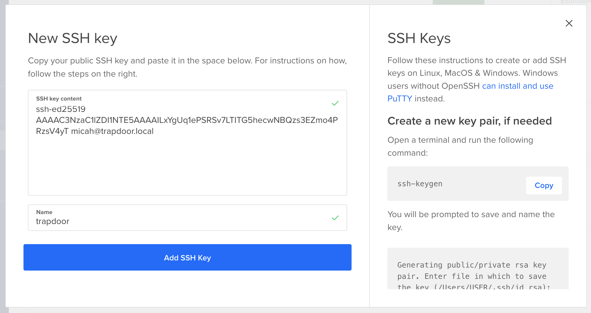
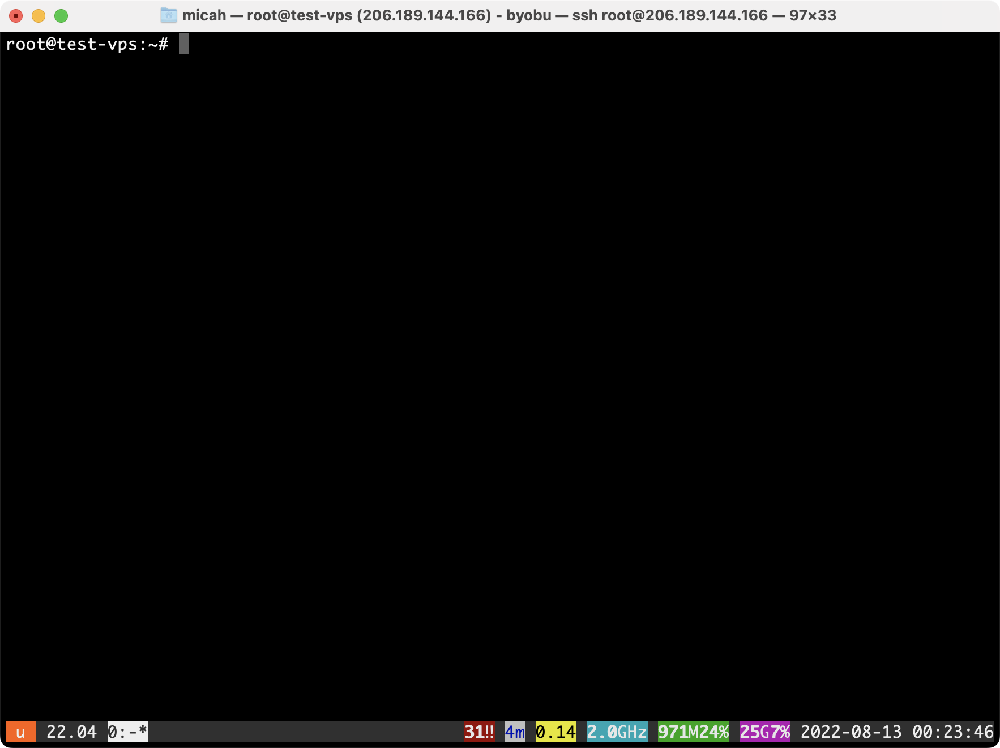

# Homework 5-4: Play With a VPS

You can use whatever cloud provider you'd like. I used [DigitalOcean](https://www.digitalocean.com/).

## Generate an SSH Key

```sh
ssh-keygen -t ed25519
```

For example:

```
micah@trapdoor ~ % ssh-keygen -t ed25519
Generating public/private ed25519 key pair.
Enter file in which to save the key (/Users/micah/.ssh/id_ed25519):   
Created directory '/Users/micah/.ssh'.
Enter passphrase (empty for no passphrase): 
Enter same passphrase again: 
Your identification has been saved in /Users/micah/.ssh/id_ed25519
Your public key has been saved in /Users/micah/.ssh/id_ed25519.pub
The key fingerprint is:
SHA256:aGu314jS+mmmP8izQkJwkyZUEFvYp9h0Su2Sj3xq7/w micah@trapdoor.local
The key's randomart image is:
+--[ED25519 256]--+
|.+*+.            |
|o.B+ +           |
| *=.B            |
| ..* . .         |
| .. + o S        |
|  .o.+ .         |
|   oo.oo.. o     |
|   oo.=.*oo .    |
|  . o==E=o       |
+----[SHA256]-----+
```

## Add Your Public Key to The Cloud Provider

View your public key:

```sh
cat ~/.ssh/id_ed25519.pub
```

For example:

```
micah@trapdoor ~ % cat ~/.ssh/id_ed25519.pub
ssh-ed25519 AAAAC3NzaC1lZDI1NTE5AAAAILxYgUq1ePSRSv7LTITG5hecwNBQzs3EZmo4PRzsV4yT micah@trapdoor.local
```

Add it to DigitalOcean:



## Create a VPS

Create a new VPS (a "Droplet", in DigitalOcean) with these settings:

- Choose an image: Ubuntu
- Choose a plan: Shared CPU > Basic, and pick the cheapest option
- Add block storage: you can skip this
- Choose a datacenter region: the choice is yours, but I picked Singapore
- “Authentication: choose “SSH keys” and select the SSH key that you just added
- Select additional options: check the box next to Monitoring
- Finalize and create: choose one droplet, and give it a hostname like `test-vps`

Wait for it to finish and then copy the IP address. For example, my IP address is 
When DigitalOcean is done provisioning my VPS, it tells me the IP address is `178.128.22.151`.


## SSH to Your Server

You ssh to a server using `ssh username@hostname`. Since I'm using DigitalOcean, I'm SSHing as the `root` user, so my command is:

```sh
ssh root@178.128.22.151
```

Example:

```
micah@trapdoor ~ % ssh root@178.128.22.151
The authenticity of host '178.128.22.151 (178.128.22.151)' can't be established.
ED25519 key fingerprint is SHA256:062oSOXq+G1sGLIzoQdFnQvJE/BU8GLLWnNr5WUOmAs.
This key is not known by any other names
Are you sure you want to continue connecting (yes/no/[fingerprint])? yes
Warning: Permanently added '178.128.22.151' (ED25519) to the list of known hosts.
Enter passphrase for key '/Users/micah/.ssh/id_ed25519': 
Welcome to Ubuntu 22.04 LTS (GNU/Linux 5.15.0-41-generic x86_64)

 * Documentation:  https://help.ubuntu.com
 * Management:     https://landscape.canonical.com
 * Support:        https://ubuntu.com/advantage

  System information as of Sat Aug 13 00:20:54 UTC 2022

  System load:  0.3046875         Users logged in:       0
  Usage of /:   6.4% of 24.05GB   IPv4 address for eth0: 178.128.22.151
  Memory usage: 23%               IPv4 address for eth0: 10.15.0.5
  Swap usage:   0%                IPv4 address for eth1: 10.104.0.2
  Processes:    97

27 updates can be applied immediately.
13 of these updates are standard security updates.
To see these additional updates run: apt list --upgradable


The programs included with the Ubuntu system are free software;
the exact distribution terms for each program are described in the
individual files in /usr/share/doc/*/copyright.

Ubuntu comes with ABSOLUTELY NO WARRANTY, to the extent permitted by
applicable law.

root@test-vps:~# 
```

## Start a Byobu Session

```sh
byobu
```

Example:



Press CTRL-A to open a new Byobu window. Check out https://www.byobu.org for further documentation.

## Install updates

I don't need to use `sudo` because I'm logged in directly as the root user.

```sh
apt update
apt upgrade
```

Example:

```
root@test-vps:~# apt update
Hit:1 http://mirrors.digitalocean.com/ubuntu jammy InRelease
Hit:2 https://repos.insights.digitalocean.com/apt/do-agent main InRelease                                                                                    
Hit:3 https://repos-droplet.digitalocean.com/apt/droplet-agent main InRelease                                                                                
Hit:4 http://mirrors.digitalocean.com/ubuntu jammy-updates InRelease                               
Hit:5 http://mirrors.digitalocean.com/ubuntu jammy-backports InRelease       
Hit:6 http://security.ubuntu.com/ubuntu jammy-security InRelease             
Reading package lists... Done
Building dependency tree... Done
Reading state information... Done
29 packages can be upgraded. Run 'apt list --upgradable' to see them.
W: https://repos.insights.digitalocean.com/apt/do-agent/dists/main/InRelease: Key is stored in legacy trusted.gpg keyring (/etc/apt/trusted.gpg), see the DEPRECATION section in apt-key(8) for details.
root@test-vps:~# apt upgrade
Reading package lists... Done
Building dependency tree... Done
Reading state information... Done
Calculating upgrade... Done
The following NEW packages will be installed:
  linux-headers-5.15.0-46 linux-headers-5.15.0-46-generic linux-image-5.15.0-46-generic linux-modules-5.15.0-46-generic
The following packages have been kept back:
  python3-software-properties software-properties-common
The following packages will be upgraded:
  base-files cryptsetup cryptsetup-bin cryptsetup-initramfs libc-bin libc6 libcryptsetup12 libfreetype6 libgnutls30 libgstreamer1.0-0 libnetplan0
  libtirpc-common libtirpc3 linux-headers-generic linux-headers-virtual linux-image-virtual linux-virtual locales motd-news-config netplan.io
  python-apt-common python3-apt python3-distupgrade python3-gi python3-jwt snapd ubuntu-release-upgrader-core
27 upgraded, 4 newly installed, 0 to remove and 2 not upgraded.
9 standard security updates
Need to get 84.0 MB of archives.
After this operation, 237 MB of additional disk space will be used.
Do you want to continue? [Y/n] y
Get:1 http://mirrors.digitalocean.com/ubuntu jammy-updates/main amd64 motd-news-config all 12ubuntu4.2 [4612 B]
Get:2 http://mirrors.digitalocean.com/ubuntu jammy-updates/main amd64 libc6 amd64 2.35-0ubuntu3.1 [3235 kB]
Get:3 http://mirrors.digitalocean.com/ubuntu jammy-updates/main amd64 base-files amd64 12ubuntu4.2 [62.7 kB]
Get:4 http://mirrors.digitalocean.com/ubuntu jammy-updates/main amd64 libc-bin amd64 2.35-0ubuntu3.1 [706 kB]       
--snip--
```

After installing updates, you might need to reboot:

```sh
reboot
```

## Use BitTorrent From the CLI

```sh
apt install transmission-cli
```

Example:

```
root@test-vps:~# apt install transmission-cli
Reading package lists... Done
Building dependency tree... Done
Reading state information... Done
The following additional packages will be installed:
  libevent-2.1-7 libminiupnpc17 libnatpmp1 transmission-common
Suggested packages:
  minissdpd natpmpc transmission-daemon transmission-gtk
The following NEW packages will be installed:
  libevent-2.1-7 libminiupnpc17 libnatpmp1 transmission-cli transmission-common
0 upgraded, 5 newly installed, 0 to remove and 2 not upgraded.
Need to get 711 kB of archives.
After this operation, 2297 kB of additional disk space will be used.
Do you want to continue? [Y/n] y
Get:1 http://mirrors.digitalocean.com/ubuntu jammy/main amd64 libevent-2.1-7 amd64 2.1.12-stable-1build3 [148 kB]
Get:2 http://mirrors.digitalocean.com/ubuntu jammy/main amd64 libminiupnpc17 amd64 2.2.3-1build1 [27.7 kB]
Get:3 http://mirrors.digitalocean.com/ubuntu jammy/main amd64 libnatpmp1 amd64 20150609-7.1build2 [7716 B]
Get:4 http://mirrors.digitalocean.com/ubuntu jammy/main amd64 transmission-common all 3.00-2ubuntu2 [206 kB]
--snip--
```

Create a folder for datasets:

```sh
mkdir ~/datasets
cd ~/datasets
```

Download the Oath Keepers dataset:

```sh
wget https://ddosecrets.com/images/0/02/Oath_Keepers.torrent
transmission-cli -w . Oath_Keepers.torrent
```

For example:

```
root@test-vps:~/datasets# wget https://ddosecrets.com/images/0/02/Oath_Keepers.torrent
--2022-08-13 00:27:41--  https://ddosecrets.com/images/0/02/Oath_Keepers.torrent
Resolving ddosecrets.com (ddosecrets.com)... 104.26.2.199, 104.26.3.199, 172.67.75.15, ...
Connecting to ddosecrets.com (ddosecrets.com)|104.26.2.199|:443... connected.
HTTP request sent, awaiting response... 200 OK
Length: 45109 (44K) [application/x-bittorrent]
Saving to: ‘Oath_Keepers.torrent’

Oath_Keepers.torrent    100%[===========================================>]  44.05K  --.-KB/s    in 0s

2022-08-13 00:27:42 (180 MB/s) - ‘Oath_Keepers.torrent’ saved [45109/45109]

root@test-vps:~/datasets# transmission-cli -w . Oath_Keepers.torrent
transmission-cli 3.00 (bb6b5a062e)
[2022-08-13 00:27:46.525] Transmission 3.00 (bb6b5a062e) started
[2022-08-13 00:27:46.526] RPC Server: Adding address to whitelist: 127.0.0.1
[2022-08-13 00:27:46.526] RPC Server: Adding address to whitelist: ::1
--snip--
Progress: 4.5%, dl from 7 of 8 peers (7.44 MB/s), ul to 0 (0 kB/s) [0.00]      
```

Press CTRL-C when the download is finished.

## Explore the Dataset

```sh
# Change to the Oath Keepers folder
cd Oath\ Keepers/
# Measure disk space
du -sh .
# List files
ls -lh
# Change folder
cd Oath\ Keepers.sbd/
# List more files
ls -lh
```

Example:

```
root@test-vps:~/datasets# cd Oath\ Keepers/
root@test-vps:~/datasets/Oath Keepers# du -sh .
3.9G	.
root@test-vps:~/datasets/Oath Keepers# ls -lh
total 13M
drwxr-xr-x 2 root root 4.0K Aug 13 00:31 'Oath Keepers.sbd'
-rw-r--r-- 1 root root  12M Aug 13 00:31  messages.json
-rw-r--r-- 1 root root 1.4M Aug 13 00:28  messages_old.json
root@test-vps:~/datasets/Oath Keepers# cd Oath\ Keepers.sbd/
root@test-vps:~/datasets/Oath Keepers/Oath Keepers.sbd# ls -lh
total 3.9G
-rw-r--r-- 1 root root 2.2M Aug 13 00:28  Archive
-rw-r--r-- 1 root root  23K Aug 13 00:28 'Saved Correspondence'
-rw-r--r-- 1 root root  25K Aug 13 00:28  Systems
-rw-r--r-- 1 root root 2.8M Aug 13 00:28  ak
-rw-r--r-- 1 root root  40M Aug 13 00:31  al
-rw-r--r-- 1 root root 283K Aug 13 00:28  alb
-rw-r--r-- 1 root root  14M Aug 13 00:31  ar
-rw-r--r-- 1 root root  31M Aug 13 00:31  az
-rw-r--r-- 1 root root  24M Aug 13 00:31  ca
-rw-r--r-- 1 root root  14K Aug 13 00:28  carter
-rw-r--r-- 1 root root 111M Aug 13 00:31  co
-rw-r--r-- 1 root root 595M Aug 13 00:31  contact
-rw-r--r-- 1 root root  73K Aug 13 00:28  copyright-claims
-rw-r--r-- 1 root root  37M Aug 13 00:31  ct
-rw-r--r-- 1 root root 8.1M Aug 13 00:30  de
-rw-r--r-- 1 root root  205 Aug 13 00:28  dead.letter
-rw-r--r-- 1 root root  183 Aug 13 00:28  dead.letter335
-rw-r--r-- 1 root root  36M Aug 13 00:31  disaster-volunteers
-rw-r--r-- 1 root root  21K Aug 13 00:28  disgruntled
-rw-r--r-- 1 root root  36K Aug 13 00:28  drafts
-rw-r--r-- 1 root root  11K Aug 13 00:28  drafts52
-rw-r--r-- 1 root root  39M Aug 13 00:31  fl
-rw-r--r-- 1 root root 2.3M Aug 13 00:28  ga
-rw-r--r-- 1 root root  12M Aug 13 00:31  hi
-rw-r--r-- 1 root root  17M Aug 13 00:31  ia
-rw-r--r-- 1 root root  15M Aug 13 00:31  id
-rw-r--r-- 1 root root  15M Aug 13 00:31  il
-rw-r--r-- 1 root root  14M Aug 13 00:31  in
-rw-r--r-- 1 root root  48M Aug 13 00:31  info
-rw-r--r-- 1 root root 4.3M Aug 13 00:30  jeo
-rw-r--r-- 1 root root 4.5K Aug 13 00:28  josey-fold
-rw-r--r-- 1 root root  99M Aug 13 00:31  jpj
-rw-r--r-- 1 root root  15M Aug 13 00:31  ks
-rw-r--r-- 1 root root  19M Aug 13 00:31  ky
-rw-r--r-- 1 root root  29M Aug 13 00:31  la
-rw-r--r-- 1 root root 4.1K Aug 13 00:28  leo
-rw-r--r-- 1 root root  36M Aug 13 00:31  ma
-rw-r--r-- 1 root root 7.7M Aug 13 00:30  mail
-rw-r--r-- 1 root root  24K Aug 13 00:28  mbox
-rw-r--r-- 1 root root  18M Aug 13 00:31  md
-rw-r--r-- 1 root root  16M Aug 13 00:31  me
-rw-r--r-- 1 root root  79M Aug 13 00:31  media
-rw-r--r-- 1 root root 101K Aug 13 00:28  membership
-rw-r--r-- 1 root root 102M Aug 13 00:31  mi
-rw-r--r-- 1 root root  13M Aug 13 00:31  mn
-rw-r--r-- 1 root root 3.2M Aug 13 00:29  mo
-rw-r--r-- 1 root root  13M Aug 13 00:31  ms
-rw-r--r-- 1 root root  14M Aug 13 00:31  mt
-rw-r--r-- 1 root root  22M Aug 13 00:31  nc
-rw-r--r-- 1 root root  17M Aug 13 00:30  nd
-rw-r--r-- 1 root root 4.8M Aug 13 00:31  ne
-rw-r--r-- 1 root root  14M Aug 13 00:30  nh
-rw-r--r-- 1 root root 101M Aug 13 00:31  nj
-rw-r--r-- 1 root root  11M Aug 13 00:31  nm
-rw-r--r-- 1 root root 3.6M Aug 13 00:29  nv
-rw-r--r-- 1 root root 102M Aug 13 00:31  ny
-rw-r--r-- 1 root root 9.3M Aug 13 00:31  oh
-rw-r--r-- 1 root root 111M Aug 13 00:31  ok
-rw-r--r-- 1 root root 1.4G Aug 13 00:31  oksupport
-rw-r--r-- 1 root root  98M Aug 13 00:31  or
-rw-r--r-- 1 root root  16M Aug 13 00:31  pa
-rw-r--r-- 1 root root 263K Aug 13 00:28  picrights.com
-rw-r--r-- 1 root root 2.5M Aug 13 00:28  press
-rw-r--r-- 1 root root 2.9M Aug 13 00:28  rallypay
-rw-r--r-- 1 root root  22K Aug 13 00:28 'read and returned'
-rw-r--r-- 1 root root  12K Aug 13 00:28  refund
-rw-r--r-- 1 root root  16M Aug 13 00:30  ri
-rw-r--r-- 1 root root  64M Aug 13 00:31  root
-rw-r--r-- 1 root root 9.0M Aug 13 00:30  sc
-rw-r--r-- 1 root root  13M Aug 13 00:31  sd
-rw-r--r-- 1 root root 3.1K Aug 13 00:28  sent
-rw-r--r-- 1 root root 3.0K Aug 13 00:28  sent858
-rw-r--r-- 1 root root 1.2K Aug 13 00:28  sentmail
-rw-r--r-- 1 root root  13K Aug 13 00:28  sentmail197
-rw-r--r-- 1 root root  19M Aug 13 00:31  sentmail34
-rw-r--r-- 1 root root 8.4K Aug 13 00:28  sentmail458
-rw-r--r-- 1 root root 3.2M Aug 13 00:28  sentmail490
-rw-r--r-- 1 root root  24K Aug 13 00:28  sentmail497
-rw-r--r-- 1 root root  634 Aug 13 00:28  sentmail587
-rw-r--r-- 1 root root 2.3M Aug 13 00:30  sentmail648
-rw-r--r-- 1 root root 146K Aug 13 00:28  sentmail651
-rw-r--r-- 1 root root 2.9K Aug 13 00:28  sentmail654
-rw-r--r-- 1 root root 4.9K Aug 13 00:28  sentmail687
-rw-r--r-- 1 root root  830 Aug 13 00:28  sentmail738
-rw-r--r-- 1 root root 7.1K Aug 13 00:28  sentmail833
-rw-r--r-- 1 root root  18M Aug 13 00:31  sentmail881
-rw-r--r-- 1 root root 3.8K Aug 13 00:28  sentmail936
-rw-r--r-- 1 root root 9.1K Aug 13 00:28  sentmail95
-rw-r--r-- 1 root root 3.3M Aug 13 00:30  stewart.rhodes
-rw-r--r-- 1 root root  13M Aug 13 00:30  tn
-rw-r--r-- 1 root root 245M Aug 13 00:31  trash961
-rw-r--r-- 1 root root  14M Aug 13 00:31  tx
-rw-r--r-- 1 root root 3.7M Aug 13 00:28  ut
-rw-r--r-- 1 root root 2.3M Aug 13 00:31  va
-rw-r--r-- 1 root root 1.7M Aug 13 00:28  volunteers
-rw-r--r-- 1 root root  41M Aug 13 00:31  vt
-rw-r--r-- 1 root root  43M Aug 13 00:31  wa
-rw-r--r-- 1 root root  12M Aug 13 00:30  wi
-rw-r--r-- 1 root root  13M Aug 13 00:30  wv
-rw-r--r-- 1 root root 5.3M Aug 13 00:30  wy
root@test-vps:~/datasets/Oath Keepers/Oath Keepers.sbd# 
```

## Use Tor From the CLI

Install tor:

```sh
apt install tor
```

Example:

```
root@test-vps:~# apt install tor
Reading package lists... Done
Building dependency tree... Done
Reading state information... Done
The following additional packages will be installed:
  tor-geoipdb torsocks
Suggested packages:
  mixmaster torbrowser-launcher socat apparmor-utils nyx obfs4proxy
The following NEW packages will be installed:
  tor tor-geoipdb torsocks
0 upgraded, 3 newly installed, 0 to remove and 2 not upgraded.
Need to get 2830 kB of archives.
After this operation, 15.3 MB of additional disk space will be used.
Do you want to continue? [Y/n] y
Get:1 http://mirrors.digitalocean.com/ubuntu jammy/universe amd64 tor amd64 0.4.6.10-1 [1665 kB]
--snip--
```

Check your country with and without Tor:

```sh
# Without Tor
curl https://ifconfig.co/country
# With Tor
torify curl https://ifconfig.co/country
```

Example:

```
root@test-vps:~# curl https://ifconfig.co/country
Singapore
root@test-vps:~# torify curl https://ifconfig.co/country
Austria
```

## Delete Your VPS

When you're done using it, remember to delete your VPS from DigitalOcean so you won't be charged more for it.
