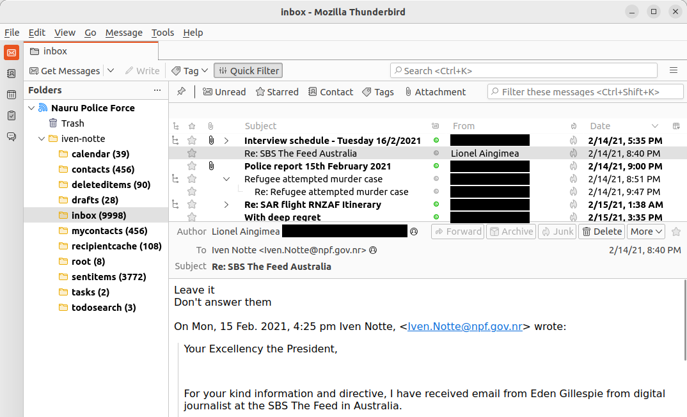

# Homework 7-3: Import EML Files Into Thunderbird

In this homework you'll import the `iven-notte` folder from the Nauru Police Force email dump into Thunderbird.

## Create a Local Folder

- Click the Thunderbird menu icon in the top-right corner and choose Account Settings.
- Click the Account Actions drop-down menu on the left side of the screen and choose Add Feed Account.
- Under "Account Name" type `Nauru Police Force`, click Next, then click Finish.

## Import the EML Files

- Switch back to the main tab.
- Right-click on the `Nauru Police Force` feed and choose New Folder.
- Name your folder `iven-notte` and click Create Folder.
- Right-click on the `iven-notte` folder and choose ImportExportTools NG > Import all messages from a directory > also from its subdirectories.
- Browse for your `iven-notte` folder and import it.

