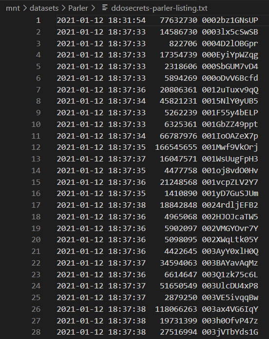

# Homework 8-1: Download the Parler Video Metadata

Read the instructions on the _DDoSecrets_ [Parler page](https://ddosecrets.com/wiki/Parler).

Open a terminal, change to your datasets USB disk, create a _Parler_ folder, and use the `wget` command to download the list of filenames and the video metadata:

```sh
cd /mnt/datasets
mkdir Parler
cd Parler
wget https://s3.wasabisys.com/ddosecrets-parler/ddosecrets-parler-listing.txt.gz
wget https://s3.wasabisys.com/ddosecrets-parler/metadata.tar.gz
```

For example:

```
micah@cloak:~$ cd /mnt/datasets/
micah@cloak:/mnt/datasets$ mkdir Parler
micah@cloak:/mnt/datasets$ cd Parler/
micah@cloak:/mnt/datasets/Parler$ which wget
/usr/bin/wget
micah@cloak:/mnt/datasets/Parler$ ls
micah@cloak:/mnt/datasets/Parler$ wget https://s3.wasabisys.com/ddosecrets-parler/ddosecrets-parler-listing.txt.gz
--2022-04-08 11:52:41--  https://s3.wasabisys.com/ddosecrets-parler/ddosecrets-parler-listing.txt.gz
Resolving s3.wasabisys.com (s3.wasabisys.com)... 38.27.106.51, 38.27.106.53
Connecting to s3.wasabisys.com (s3.wasabisys.com)|38.27.106.51|:443... connected.
HTTP request sent, awaiting response... 200 OK
Length: 17790173 (17M) [application/x-gzip]
Saving to: ‘ddosecrets-parler-listing.txt.gz’

ddosecrets-parler-listing.txt.gz       100%[============================================================================>]  16.97M  4.86MB/s    in 4.1s

2022-04-08 11:52:45 (4.09 MB/s) - ‘ddosecrets-parler-listing.txt.gz’ saved [17790173/17790173]

micah@cloak:/mnt/datasets/Parler$ wget https://s3.wasabisys.com/ddosecrets-parler/metadata.tar.gz
--2022-04-08 11:52:47--  https://s3.wasabisys.com/ddosecrets-parler/metadata.tar.gz
Resolving s3.wasabisys.com (s3.wasabisys.com)... 38.27.106.51, 38.27.106.53
Connecting to s3.wasabisys.com (s3.wasabisys.com)|38.27.106.51|:443... connected.
HTTP request sent, awaiting response... 200 OK
Length: 212461278 (203M) [application/x-tar]
Saving to: ‘metadata.tar.gz’

metadata.tar.gz                        100%[============================================================================>] 202.62M  14.3MB/s    in 32s

2022-04-08 11:53:20 (6.28 MB/s) - ‘metadata.tar.gz’ saved [212461278/212461278]

micah@cloak:/mnt/datasets/Parler$ ls -lh
total 220M
-rw-r--r-- 1 micah micah  17M Mar 28  2021 ddosecrets-parler-listing.txt.gz
-rw-r--r-- 1 micah micah 203M Mar 15  2021 metadata.tar.gz
```

Both of these files are compressed.

## List of Video Filenames

Decompress the list of video filenames:

```sh
gunzip ddosecrets-parler-listing.txt.gz
```

For example:

```
micah@cloak:/mnt/datasets/Parler$ gunzip ddosecrets-parler-listing.txt.gz
micah@cloak:/mnt/datasets/Parler$ ls -lh
total 246M
-rw-r--r-- 1 micah micah  44M Mar 28  2021 ddosecrets-parler-listing.txt
-rw-r--r-- 1 micah micah 203M Mar 15  2021 metadata.tar.gz
micah@cloak:/mnt/datasets/Parler$ cat ddosecrets-parler-listing.txt | wc -l
1031509
```

It has 1,031,509 lines. Open _ddosecrets-parler-listing.txt_ in a text editor. Here's what it looks like:



The last column of each line is a filename. For example, if you want to download the video with the filename of _0003lx5cSwSB_, you will download `https://s3.wasabisys.com/ddosecrets-parler/0003lx5cSwSB`. Give it a try. In this case, I’m creating a new folder called videos to download the videos into.

```sh
mkdir videos
cd videos
wget https://s3.wasabisys.com/ddosecrets-parler/0003lx5cSwSB
```

For example:

```
micah@cloak:/mnt/datasets/Parler$ mkdir videos
micah@cloak:/mnt/datasets/Parler$ cd videos/
micah@cloak:/mnt/datasets/Parler/videos$ wget https://s3.wasabisys.com/ddosecrets-parler/0003lx5cSwSB
--2022-04-08 11:55:21--  https://s3.wasabisys.com/ddosecrets-parler/0003lx5cSwSB
Resolving s3.wasabisys.com (s3.wasabisys.com)... 38.27.106.51, 38.27.106.53
Connecting to s3.wasabisys.com (s3.wasabisys.com)|38.27.106.51|:443... connected.
HTTP request sent, awaiting response... 200 OK
Length: 14586730 (14M) [binary/octet-stream]
Saving to: ‘0003lx5cSwSB’

0003lx5cSwSB                           100%[============================================================================>]  13.91M  5.27MB/s    in 2.6s

2022-04-08 11:55:24 (5.27 MB/s) - ‘0003lx5cSwSB’ saved [14586730/14586730]
```

To watch the videos, you must rename them to have the file extension _.mp4_. You can rename this file like:

```sh
mv 0003lx5cSwSB 0003lx5cSwSB.mp4
```

Now you can watch the video using software like [VLC Media Player](https://www.videolan.org/).

## Video Metadata

In your terminal, change back to the _Parler_ dataset folder and decompress _metadata.tar.gz` like this:

```sh
tar -xvf metadata.tar.gz
```

For example:

```
micah@cloak:/mnt/datasets/Parler/videos$ cd ..
micah@cloak:/mnt/datasets/Parler$ tar -xvf metadata.tar.gz
metadata/
metadata/.aws/
metadata/meta-00CnBY5xCdca.json
metadata/meta-0003lx5cSwSB.json
metadata/meta-0070HNolzi3z.json
metadata/meta-00BIFOMnOyi1.json
metadata/meta-0002bz1GNsUP.json
metadata/meta-0015NlY0yUB5.json
metadata/meta-00DeGeeF9M25.json
--snip--
```