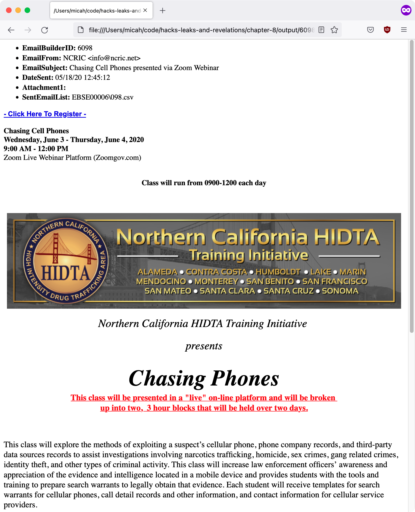

# Homework 8-3: Make Bulk Emails Readable

In this homework assignment, you will write a script that takes the path to a `EmailBuilder.csv` file, and the path to an output folder, as input. For each row in the CSV, it should create an HTML file in the output folder describing that bulk email, including with a readable version of the HTML email body. Here's the template Python script to get you started:

```python
import click

@click.command()
@click.argument("emailbuilder_csv_path", "output_folder_path")
def main(emailbuilder_csv_path, output_folder_path):
    """Make bulk emails in BlueLeaks easier to read"""

if __name__ == "__main__":
    main()
```

First, I need to import the `os` module and make sure that the folder described in `output_folder_path` exists. I import the `os` module by adding this to the top:

```python
import os
```

And then I make sure that the folder is created by adding this to the `main()` function:

```python
# Make sure output_folder_path exists and is a folder
os.makedirs(output_folder_path, exist_ok=True)
```

Then I want to load the CSV and loop through its rows. So I import the `csv` module at the top:

```python
import csv
```

And then some code to loop through the rows in `emailbuilder_csv_path`:

```python
# Load the EmailBuidler.csv file and loop through its rows
with open(emailbuilder_csv_path) as f:
    reader = csv.DictReader(f)
    for row in reader:
        pass
```

I want to save each row as its own HTML file, so I need to come up with its filename. Inside the for loop, I'll define a `filename` variable, and I'll also make sure to replace all of the slashes with dashes--otherwise, Python will have trouble opening the file for writing because the slash character separates folders:

```python
filename = f"{row['EmailBuilderID']}_{row['DateSent']}_{row['EmailSubject']}.html"
filename = filename.replace("/", "-")
```

Next, I'll open that file (for writing). Since I want to save this file inside the `output_folder_path` folder, I'll use the `os.path.join()` function to connect `output_folder_path` and `filename`. And while I'm at it, I'll write the first line of HTML, a comment, the email body itself, and the last line of HTML.

```python
# Open the HTML file for writing
with open(os.path.join(output_folder_path, filename), "w") as f:
    f.write("<html><body>\n")
    # TODO: write all of the other important fields here
    f.write(f"<div>{row['EmailBody']}</div>\n")
    f.write("</body></html>\n")
    print(f"Saved file: {filename}")
```

Now it's time to display the rest of the important fields. Near the top of the `main()` function, before opening the file for writing, I will define a variable called `important_keys` and set it to a list of the extra fields (besides `EmailBody`) that I want to include in my HTML files:

```python
# A list of fields to include in the HTML output
important_keys = [
    "EmailBuilderID",
    "EmailFrom",
    "EmailSubject",
    "DateSent",
    "Attachment1",
    "SentEmailList",
]
```

Now, back inside the for loop, I want to replace the comment `# TODO: write all of the other important fields here` with code that actually writes those fields to the file. That code looks like this:

```python
f.write("<ul>\n")
for key in important_keys:
    f.write(f"<li><strong>{key}:</strong> {html.escape(row[key])}</li>\n")
f.write("</ul>\n")
```

Since this code uses the `html.escape()` function, I also import the `html` module up at the top of the script:

```python
import html
```

## The Final Script

Here's what it looks like when I run this script on NCRIC's `EmailBuilder.csv` file:

```
micah@trapdoor chapter-8 % python3 homework-8-3.py /Volumes/datasets/BlueLeaks-extracted/ncric/EmailBuilder.csv ./output
Saved file: 4867_09-04-18 09:13:49_2018 CNOA Training Institute.html
Saved file: 4868_09-04-18 14:33:27_SMS Important.html
Saved file: 4869_09-04-18 14:47:52_Brian SMS from Netsential.html
Saved file: 4870_09-05-18 12:57:23_(U--LES) Officer Safety-Welfare Check Bulletin - Wesley Drake GRIFFIN.html
Saved file: 4871_09-05-18 11:20:12_2018 CNOA Training Institute.html
Saved file: 3687_01-24-17 18:09:02_17-013 (U--LES) NCRIC Partner Update Brief.html
Saved file: 3688_01-24-17 18:25:41_17-014 (U--FOUO) NCRIC Partner Update Brief.html
Saved file: 3689_01-25-17 16:00:36_Highway Drug Investigations for Patrol.html
--snip--
```

Here's what one of the HTML files that this script created looks like. This one is called `6098_05-18-20 12:45:12_Chasing Cell Phones presented via Zoom Webinar.html`.

