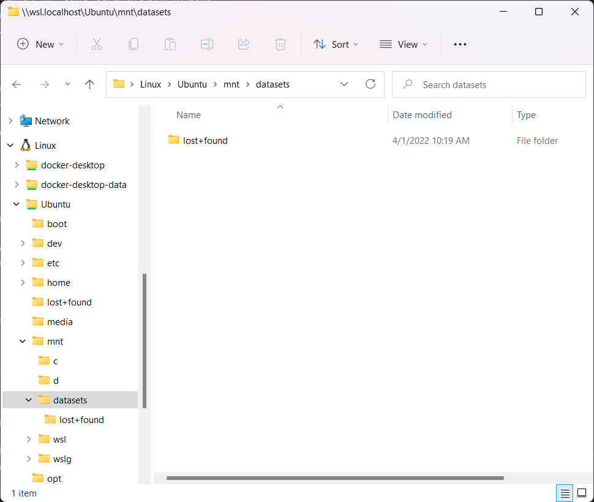
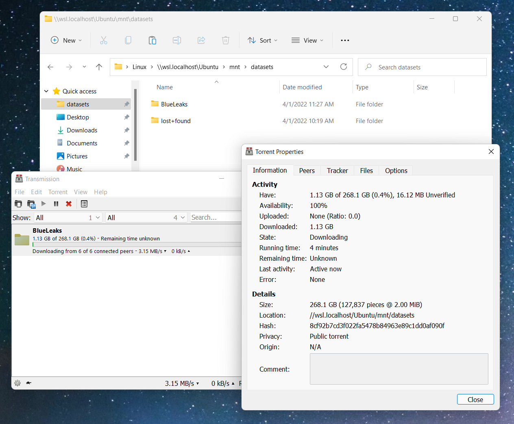

# Use an Encrypted Linux Disk in Windows with WSL

WSL allows you to use powerful Linux tools directly in Windows.

If you're working with large datasets, chances are you'll want to store them on a USB disk. And unfortunately, there are some [major performance issues](https://github.com/microsoft/WSL/issues/4197#issuecomment-604592340) when working in Windows filesystems from inside WSL (like `/mnt/c` or `/mnt/d`).

One way to get around this problem is to format your USB disk with a Linux filesystem instead of a Windows one. This guide shows you how to create and use an encrypted Linux USB disk in Windows with WSL.

## Limitations

- **You must be using Windows 11 or newer.** Older versions, like Windows 10, don't support mounting USB disks inside WSL.
- **You must use an actual USB hard disk.** USB flash drives are not supported.

## Useful Resources

- [Mount a Linux disk in WSL 2](https://docs.microsoft.com/en-us/windows/wsl/wsl2-mount-disk)
- [Servicing the Windows Subsystem for Linux (WSL) 2 Linux kernel](https://devblogs.microsoft.com/commandline/servicing-the-windows-subsystem-for-linux-wsl-2-linux-kernel/)

## Contents

- [Install Updates in Linux](#install_updates)
- [Format Your USB Disk](#format)
- [Setup Your Encrypted Linux USB Disk for the First Time](#setup)
  - [Identify the DeviceID](#setup_identify_deviceid)
  - [Mount the Disk Into WSL](#setup_mount_wsl)
  - [Identify the Block Device](#setup_identify_block_device)
  - [Create the Encrypted Linux Partition](#setup_create)
  - [Mount the Encrypted Linux Partition](#setup_mount)
  - [Unmount Everything](#setup_unmount)
- [Mount Your Encrypted Linux USB Disk](#mount)
- [Unmount Your Encrypted Linux USB Disk](#unmount)
- [Using Your Linux Disk in Windows](#using)

# <a id="install_updates"></a>Install Updates in Linux

Start by opening an Ubuntu terminal and install all of the updates. Specifically, we want to make sure you have the most recent Linux kernel available.

```sh
sudo apt update
sudo apt upgrade -y
```

After installing updates, to make sure that you're using the latest version of the Linux kernel, restart WSL. To do this, open a PowerShell terminal and run:

```powershell
wsl --shutdown
```

# <a id="format"></a>Format Your USB Disk

Plug the USB disk you'd like to use into your computer. You're going to erase all of the data on this disk.

Click the **Start** button, search for "disk management," and click "Create and format hard disk partitions." This opens the Disk Management app. In the bottom half of the window, find the disk you just plugged in, right-click on all of its partitions, and choose "Delete Volume". (Make sure you're deleting volumes on the correct hard disk!)


After deleting all volumes, the whole disk should be labeled "Unallocated." Right-click on the unallocated space and choose "New Simple Volume." Follow the wizard to create a new volume that takes up the entire disk.

# <a id="setup"></a>Setup Your Encrypted Linux USB Disk for the First Time

Setting up your encrypted Linux USB disk for the first time is the trickiest part of this. Don't worry if you mess up because you can always format your USB disk again and start over. You only have to do this step once. After your USB disk is set up, it's much simpler to mount it and unmount it.

The first step is to attach this USB disk to WSL. Start by opening a PowerShell terminal _as an administrator_.

## <a id="setup_identify_deviceid"></a>Identify the DeviceID

In your administrator PowerShell terminal, run this command to show you a list of all of the disks connected to your computer:

```powershell
GET-CimInstance -query "SELECT * from Win32_DiskDrive"
```

For example:

```powershell
PS C:\Windows\system32> GET-CimInstance -query "SELECT * from Win32_DiskDrive"

DeviceID           Caption                        Partitions Size          Model
--------           -------                        ---------- ----          -----
\\.\PHYSICALDRIVE0 TOSHIBA THNSNJ512GCSU          3          512105932800  TOSHIBA THNSNJ512GCSU
\\.\PHYSICALDRIVE1 WD My Passport 0830 USB Device 1          1000169372160 WD My Passport 0830 USB Device
```

Find the `DeviceID` of your USB disk. In my case, it's `\\.\PHYSICALDRIVE1`.

## <a id="setup_mount_wsl"></a>Mount the Disk Into WSL

Now mount the disk so that WSL can access it by running this, replacing `<DeviceID>` with the `DeviceID` you identified in the previous step:

```powershell
wsl --mount <DeviceID> --bare
```

For example:

```powershell
PS C:\Windows\system32> wsl --mount \\.\PHYSICALDRIVE1 --bare
```

## <a id="setup_identify_block_device"></a>Identify the Block Device

In Linux, disks and partitions are known as "block devices." A block device is identified by the filename `/dev/<Device><Partition>`. For example, `/dev/sdc3`, is the partition number 3 of disk `sdc`. You need to find out the block device filename for the new partition that you created in Disk Management.

Open an Ubuntu terminal and run this command to list all of the block devices Linux has access to:

```sh
lsblk
```

For example:

```
micah@cloak:~$ lsblk
NAME   MAJ:MIN RM   SIZE RO TYPE MOUNTPOINT
loop0    7:0    0 331.6M  1 loop /mnt/wsl/docker-desktop/cli-tools
loop1    7:1    0 302.9M  1 loop
sda      8:0    0   256G  0 disk
sdb      8:16   0 339.8M  1 disk
sdc      8:32   0   256G  0 disk /
sdd      8:48   0   256G  0 disk /mnt/wsl/docker-desktop/docker-desktop-proxy
sde      8:64   0   256G  0 disk /mnt/wsl/docker-desktop-data/isocache
sdf      8:80   0 931.5G  0 disk
├─sdf1   8:81   0    16M  0 part
└─sdf2   8:82   0 931.5G  0 part
```

In my case, the block device for the partition I just formatted is `/dev/sdf2`. Make sure you identify the correct block device for your disk.

## <a id="setup_create"></a>Create the Encrypted Linux Partition

Before you can encrypt a disk, you'll need to generate a passphrase that you will use to unlock it. Generate a new strong passphrase in your password manager and make sure to save it.

In your Ubuntu terminal, run these commands to encrypt the partition, unlock the encrypted partition, and then create a Linux filesystem inside this encrypted partition. Make sure to change `/dev/sdf2` to whatever your block device is. You must confirm by typing `YES`, and type your passphrase twice.

```sh
sudo cryptsetup luksFormat /dev/sdf2
```

For example:

```
micah@cloak:~$ sudo cryptsetup luksFormat /dev/sdf2
WARNING: Device /dev/sdf2 already contains a 'ntfs' superblock signature.

WARNING!
========
This will overwrite data on /dev/sdf2 irrevocably.

Are you sure? (Type uppercase yes): YES
Enter passphrase for /dev/sdf2:
Verify passphrase:
WARNING: Locking directory /run/cryptsetup is missing!
micah@cloak:~$
```

You can disregard the warning about the device already containing an NTFS partition. This is a Windows partition that you will be overwriting. And you can disregard the warning about the locking directory missing.

Now unlock the partition by running this command. You'll need to type the passphrase to unlock it.

```sh
sudo cryptsetup luksOpen /dev/sdf2 encrypted-disk
```

For example:

```
micah@cloak:~$ sudo cryptsetup luksOpen /dev/sdf2 encrypted-disk
Enter passphrase for /dev/sdf2:
micah@cloak:~$
```

Now that it's unlocked, it should have created a virtual block device in `/dev/mapper/encrypted-disk`. Make sure that file is there by running:

```sh
ls -l /dev/mapper/encrypted-disk
```

For example:

```
micah@cloak:~$ ls -l /dev/mapper/encrypted-disk
brw-rw---- 1 root disk 252, 0 Apr  1 10:14 /dev/mapper/encrypted-disk
micah@cloak:~$
```

Format this block device to use a Linux partition.

```sh
sudo mkfs.ext4 /dev/mapper/encrypted-disk
```

For example:

```
micah@cloak:~$ sudo mkfs.ext4 /dev/mapper/encrypted-disk
mke2fs 1.45.5 (07-Jan-2020)
Found a atari partition table in /dev/mapper/encrypted-disk
Proceed anyway? (y,N) y
Creating filesystem with 244173568 4k blocks and 61046784 inodes
Filesystem UUID: e6e553bb-72ff-4b98-acff-c4e247a1492a
Superblock backups stored on blocks:
        32768, 98304, 163840, 229376, 294912, 819200, 884736, 1605632, 2654208,
        4096000, 7962624, 11239424, 20480000, 23887872, 71663616, 78675968,
        102400000, 214990848

Allocating group tables: done
Writing inode tables: done
Creating journal (262144 blocks): done
Writing superblocks and filesystem accounting information: done

micah@cloak:~$
```

## <a id="setup_mount"></a>Mount the Encrypted Linux Partition

You have now created an encrypted Linux partition. The next step is to _mount_ it, so you can start using it. In Linux, disks are normally mounted in the `/mnt` folder. Create a new folder, `/mnt/datasets`, to mount this disk into.

```sh
sudo mkdir /mnt/datasets
```

And mount the disk.

```sh
sudo mount /dev/mapper/encrypted-disk /mnt/datasets/
```

Now, check out what's in your new encrypted disk.

```sh
ls -l /mnt/datasets
```

For example:

```
micah@cloak:~$ ls -l /mnt/datasets
total 16
drwx------ 2 root root 16384 Apr  1 10:19 lost+found
micah@cloak:~$
```

When you create a new Linux filesystem of type `ext4`, you will start out with a folder called `lost+found`. If you see this folder, this means it worked. Now any data you save to `/mnt/datasets` gets saved to your encrypted Linux USB disk.

The final step is to change the permissions on this disk so that you can access it with your unprivileged user instead of having to use `sudo`. **This is an important step!** If you don't do this step, you won't be able to copy files to this disk from Windows.

Run this:

```sh
sudo chown -R $USER:$USER /mnt/datasets
```

## <a id="setup_unmount"></a>Unmount Everything

To unmount everything, run:

```sh
sudo umount /mnt/datasets
sudo cryptsetup luksClose /dev/mapper/encrypted-disk
```

After you unmount the disk, `/mnt/datasets` should just be an empty folder. For example:

```
micah@cloak:~$ ls -l /mnt/datasets/
total 0
```

Then, in your _administrator_ PowerShell terminal, run this.

```powershell
wsl --unmount <DeviceID>
```

For example:

```
PS C:\Windows\system32> wsl --unmount \\.\PHYSICALDRIVE1
```

# <a id="mount"></a>Mount Your Encrypted Linux USB Disk

Now that you have an encrypted Linux USB disk, here is how you mount it in WSL. You'll need to do this step each time you plug in your USB disk to start working with the datasets stored on it.

- Plug in your USB disk.
- Open a PowerShell terminal _as an administrator_.
- [Identify the `DeviceID` of your disk](#setup_identify_deviceid). For example, mine is `\\.\PHYSICALDRIVE1`.
- Mount the disk into WSL by running this command in your administrator PowerShell:
  ```powershell
  wsl --mount <DeviceID> --bare
  ```
  For example:
  ```powershell
  wsl --mount \\.\PHYSICALDRIVE1 --bare
  ```
- Open an Ubuntu terminal.
- [Identify the block device of your disk](#setup_identify_block_device). For example, mine is `/dev/sdf2`.
- Mount the encrypted Linux USB disk in Ubuntu by running these commands in your Ubuntu terminal:
  ```sh
  sudo cryptsetup luksOpen <block_device> encrypted-disk
  sudo mount /dev/mapper/encrypted-disk /mnt/datasets
  ```
  For example:
  ```sh
  sudo cryptsetup luksOpen /dev/sdf2 encrypted-disk
  sudo mount /dev/mapper/encrypted-disk /mnt/datasets
  ```
- Now your encrypted disk is mounted in `/mnt/datasets`.

# <a id="unmount"></a>Unmount Your Encrypted Linux USB Disk

If your encrypted Linux USB disk is mounted, you can unmount it like this.

- Open an Ubuntu terminal. Run these commands to unmount the partition and lock the disk:
  ```sh
  sudo umount /mnt/datasets
  sudo cryptsetup luksClose /dev/mapper/encrypted-disk
  ```
- Open a PowerShell terminal _as an administrator_ and run this command to unmount the disk from WSL:
  ```powershell
  wsl --unmount <DeviceID>
  ```
  For example:
  ```powershell
  wsl --unmount \\.\PHYSICALDRIVE1
  ```

# Using Your Linux Disk in Windows

You can copy files between your new encrypted Linux disk and files in Windows using Explorer. Open Explorer and find _Linux_ in the left sidebar. You can expand _Ubuntu_, _mnt_, _datasets_ to access the files in this disk, and to copy data onto it and off of it from Windows.



You can even drag the _datasets_ folder into Explorer's "Quick access" group on the left sidebar to make it easier to navigate to.


You can download datasets directly to your encrypted Linux disk. For example, here I'm using the [Transmission](https://transmissionbt.com/) BitTorrent client to downloading the [BlueLeaks](https://ddosecrets.com/wiki/BlueLeaks) dataset directly to my encrypted Linux USB disk, in Windows.

