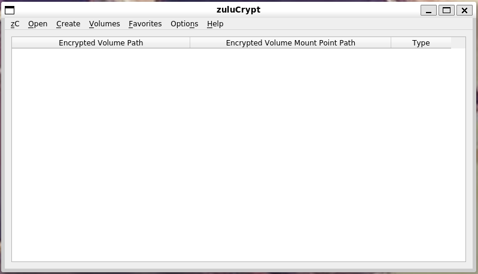
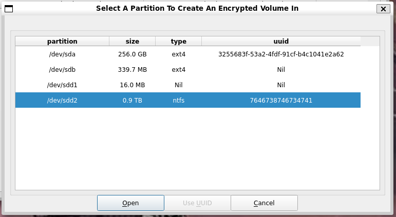
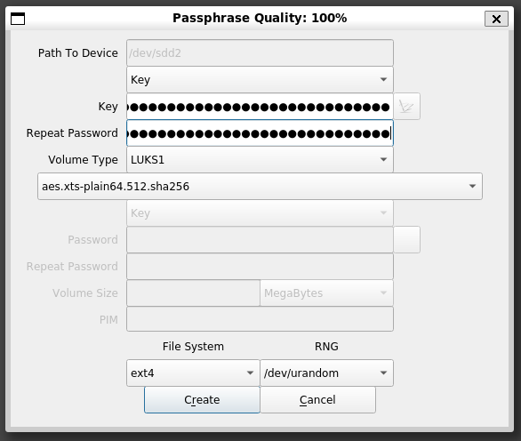

# Use an Encrypted Linux Disk in Windows with WSL

WSL allows you to use powerful Linux tools directly in Windows.

If you're working with large datasets, chances are you'll want to store them on a USB disk. And unfortunately, there are some [major performance issues](https://github.com/microsoft/WSL/issues/4197#issuecomment-604592340) when working in Windows filesystems from inside WSL (like `/mnt/c` or `/mnt/d`).

One way to get around this problem is to format your USB disk with a Linux filesystem instead of a Windows one. This guide shows you how to create and use an encrypted Linux USB disk in Windows with WSL.

## Limitations

- **You must be using Windows 11 or newer.** Older versions, like Windows 10, don't support mounting USB disks inside WSL.
- **You must use an actual USB hard disk.** USB flash drives are not supported.

## Useful Resources

- [Mount a Linux disk in WSL 2](https://docs.microsoft.com/en-us/windows/wsl/wsl2-mount-disk)
- [Servicing the Windows Subsystem for Linux (WSL) 2 Linux kernel](https://devblogs.microsoft.com/commandline/servicing-the-windows-subsystem-for-linux-wsl-2-linux-kernel/)
- [zuluCrypt](https://mhogomchungu.github.io/zuluCrypt/)

## Contents

- Install Linux Dependencies
- Attach a USB Disk to WSL and Create an Encrypted Linux USB Disk
  - Identify the DeviceID
  - Mount the Disk Into WSL
  - Create the Encrypted Linux Partition
  - Mount the Encrypted Linux Partition
  - Make a Symbolic Link
- Mount an Encrypted Linux USB Disk
- Unmount an Encrypted Linux USB Disk

# Install Linux Dependencies

Start by opening an Ubuntu terminal and install all of the updates. Specifically, we want to make sure you have the most recent Linux kernel available.

```sh
sudo apt update
sudo apt upgrade -y
```

Next, install the `zulucrypt-gui` and `xdg-utils` packages:

```sh
sudo apt install zulucrypt-gui xdg-utils -y
```

After installing updates, to make sure that you're using the latest version of the Linux kernel, restart WSL. To do this, open a PowerShell terminal and run:

```powershell
wsl --shutdown
```

# Attach a USB Disk to WSL and Create an Encrypted Linux USB Disk

Plug the USB disk you'd like to use into your computer. You're going to erase all of the data on this disk.

Start by opening a PowerShell terminal _as an administrator_.

## Identify the DeviceID

In your administrator PowerShell terminal, run this command to show you a list of all of the disks connected to your computer:

```powershell
GET-CimInstance -query "SELECT * from Win32_DiskDrive"
```

For example:

```powershell
PS C:\Windows\system32> GET-CimInstance -query "SELECT * from Win32_DiskDrive"

DeviceID           Caption                        Partitions Size          Model
--------           -------                        ---------- ----          -----
\\.\PHYSICALDRIVE0 TOSHIBA THNSNJ512GCSU          3          512105932800  TOSHIBA THNSNJ512GCSU
\\.\PHYSICALDRIVE1 WD My Passport 0830 USB Device 1          1000169372160 WD My Passport 0830 USB Device
```

Find the `DeviceID` of your USB disk. In my case, it's `\\.\PHYSICALDRIVE1`.

## Mount the Disk Into WSL

Now mount the disk so that WSL can access it by running this, replacing `<DeviceID>` with the `DeviceID` you identified in the previous step:

```powershell
wsl --mount <DeviceID> --bare
```

For example:

```powershell
PS C:\Windows\system32> wsl --mount \\.\PHYSICALDRIVE1 --bare
```

## Create the Encrypted Linux Partition

Open an Ubuntu terminal and open zuluCrypt. In WSL, you first need to run this command for zuluCrypt to work:

```sh
sudo service dbus restart
```

Then you can open zuluCrypt by running this command:

```sh
sudo zuluCrypt-gui
```

After you run this, zuluCrypt should open in a new window, like this:



Click the **Create** menu, and choose **Encrypted Container In A Hard Drive**. This will load a list of hard disks that WSL can see. Select the USB disk that you plugged in and click **Open**.

For example, in my case, my USB disk is `/dev/sdd2`.



It will warn you that it will destroy all of the data on the disk and ask, "Are you sure you want to continue?". Click **Yes**.

It will ask you if you want to write random data to the partition before creating an encrypted container in it. If there was nothing sensitive on the disk before, or if it was encrypted before, it's safe to choose **No**. If you choose **Yes** it will take a much longer time. I'm choosing **No**.

zuluCrypt will then ask for information about the new encrypted volume you'd like to create. Specifically, you need to provide a strong and unique passphrase in the "Key" and "Repeat Password" fields. Use your password manager's passphrase generator to generate one for you, and make sure to save it in your password manager.

Fill out the passphrase in the "Key" and "Repeat Password" fields. You can keep default values for the rest of the fields. Click **Create**.

For example, here's what it looked like when I did it:



It will take a few seconds to create. When it's done, zuluCrypt will show you a window that says, "Volume created successfully."

## Mount the Encrypted Linux Partition

Now, in zuluCrypt, click the **Open** menu, click **Volume Hosted In A Hard Drive**, select the USB disk, and click **Open**. The type should now be `crypto-LUKS`.

For example:


You'll then need to provide the passphrase in the "Password" field. Copy and paste it from your password manager and click **Open**.

This will mount your USB disk into a path like `/run/media/private/root/sdd2`.

Because of issues with using zuluCrypt in WSL, your encrypted Linux volume won't show up in the zuluCrypt window, but it should have worked.

You can quit zuluCrypt now. Quit it by clicking the **zC** menu and choosing **Quit** (just closing the window doesn't full quit the app). If you've already closed the window, you can force it to quit by pressing CTRL-C in your Ubuntu shell.

Back in your Ubuntu terminal, run this command so that your unprivileged user (instead of just `root`) has permission to access this disk:

```sh
sudo chown -R $USER:$USER /run/media/private/root
```

You can check to see the exact path by using `ls`. For example:

```sh
micah@cloak:~$ ls -l /run/media/private/root
total 4
drwxrwxrwx 3 micah micah 4096 Mar 24 16:44 sdd2
```

There's just a single folder called `sdd2` there, so the mount path is `/run/media/private/root/sdd2/`.

## Make a Symbolic Link

This is a long and cumbersome path though. To make it simpler, run this command to make a [symbolic link](https://en.wikipedia.org/wiki/Symbolic_link) to this path called `/mnt/datasets`:

```sh
sudo ln -s /run/media/private/root/sdd2 /mnt/datasets
```

From now on, after the USB disk is mounted, you can access it from `/mnt/datasets`. For example:

```sh
micah@cloak:~$ cd /mnt/datasets
micah@cloak:/mnt/datasets$ ls -l
total 16
drwx------ 2 micah micah 16384 Mar 24 16:44 lost+found
```

When you first create a new Linux partition there should just be a single folder called `lost+found`, so this means that this worked.
